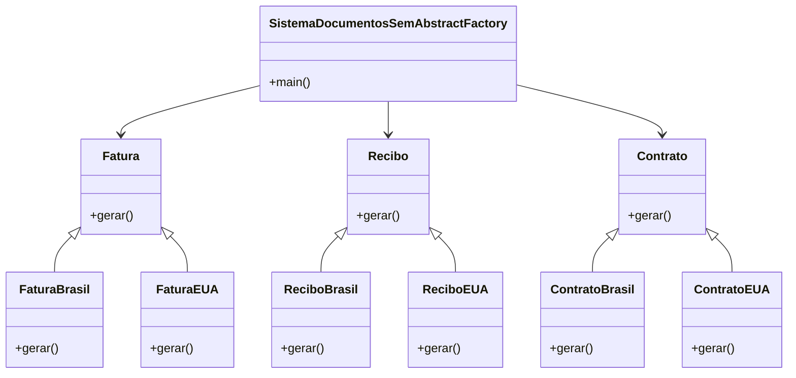
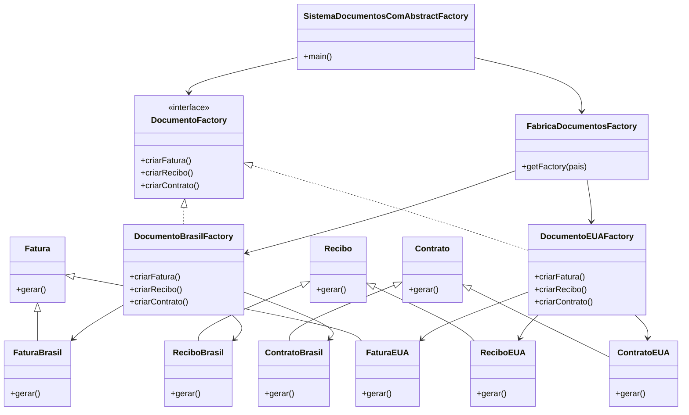

# 🏭 Abstract Factory

## 💼 Problema: Sistema de Geração de Documentos para uma Empresa Multinacional

### 🧾 Cenário

Você está desenvolvendo um Sistema de Geração de Documentos (faturas, contratos, recibos) para uma empresa que atua em vários países, como **Brasil**, **EUA** e **Alemanha**.  
Cada país possui exigências legais específicas e diferentes formatos de apresentação para seus documentos.

### 📌 Exemplos de requisitos específicos:

- **Fatura Brasil**: CNPJ, valor em **reais (R$)**, campos de impostos brasileiros.
- **Fatura EUA**: campos em **dólares (US$)**, número de identificação fiscal, layout diferente.
- **Fatura Alemanha**: vocabulário e formatação em **alemão**, com **VAT**.

O mesmo se aplica aos **recibos** e **contratos**.

---

## 🤔 Como resolveríamos **sem** um padrão de projeto?

Uma abordagem comum seria usar `if-else` ou `switch` para criar diferentes versões dos documentos, como no exemplo abaixo:

```java
if (pais.equals("Brasil")) {
    fatura = new FaturaBrasil();
} else if (pais.equals("EUA")) {
    fatura = new FaturaEUA();
}
// E assim por diante para recibo e contrato
````

Essa solução **funciona**, mas gera **código fortemente acoplado** e difícil de manter ou expandir. Cada novo país exige modificações em diversas partes do sistema.

---

## 🔧 Diagrama de Classes - Sem Abstract Factory



🔗 **Exemplo de código:** [`SistemaDocumentosSemAbstractFactory`](../código-samples/1-abstract-factory/problema)

---

## 🧪 O que é o Abstract Factory?

O **Abstract Factory** é um **padrão de projeto criacional** que fornece uma **interface para criar famílias de objetos relacionados** (como documentos de um mesmo país), sem especificar suas classes concretas.

### ✅ Vantagens do Abstract Factory

- **Desacoplamento** entre o código cliente e as classes concretas de produtos.
- **Facilidade de expansão**: adicionar uma nova “família” de produtos (por exemplo, documentos da Alemanha) requer apenas a criação de uma nova fábrica concreta.
- **Coerência entre objetos**: garante que os objetos criados (fatura, recibo, contrato) são compatíveis entre si, pois pertencem à mesma família.
- **Organização e clareza**: centraliza a lógica de criação em fábricas específicas.
- **Flexibilidade**: o cliente pode trabalhar com qualquer família de produtos apenas mudando a fábrica usada.

---

### ⚠️ Desvantagens do Abstract Factory

- **Complexidade adicional**: pode parecer excessivo para sistemas pequenos ou com poucas variações de produtos.
- **Mais código**: exige a criação de muitas interfaces e classes, mesmo para objetos simples.
- **Rigidez na hierarquia**: se os produtos da família variarem demais entre si, o padrão pode se tornar difícil de aplicar.

---

## 🧩 Como aplicar o padrão ao problema?

Com o Abstract Factory, criamos uma **fábrica abstrata de documentos** (`DocumentoFactory`) e implementações concretas para cada país (`DocumentoBrasilFactory`, `DocumentoEUAFactory`, etc.).

Cada fábrica sabe criar **todos os documentos do seu país**.

```java
DocumentoFactory factory = FabricaDocumentosFactory.getFactory("Brasil");

Fatura fatura = factory.criarFatura();
Recibo recibo = factory.criarRecibo();
Contrato contrato = factory.criarContrato();
```

---

## 🧱 Diagrama de Classes - Com Abstract Factory



🔗 **Exemplo de código:** [`SistemaDocumentosComAbstractFactory`](../código-samples/1-abstract-factory/solucao)

---

## 🎯 Conclusão

O uso do Abstract Factory neste cenário:

* Elimina estruturas de controle como `if-else` para decidir qual classe instanciar.
* Facilita a adição de novos países, bastando criar uma nova fábrica.
* Organiza melhor o código, respeitando os princípios de **abstração**, **responsabilidade única** e **abertura para extensão**.

---