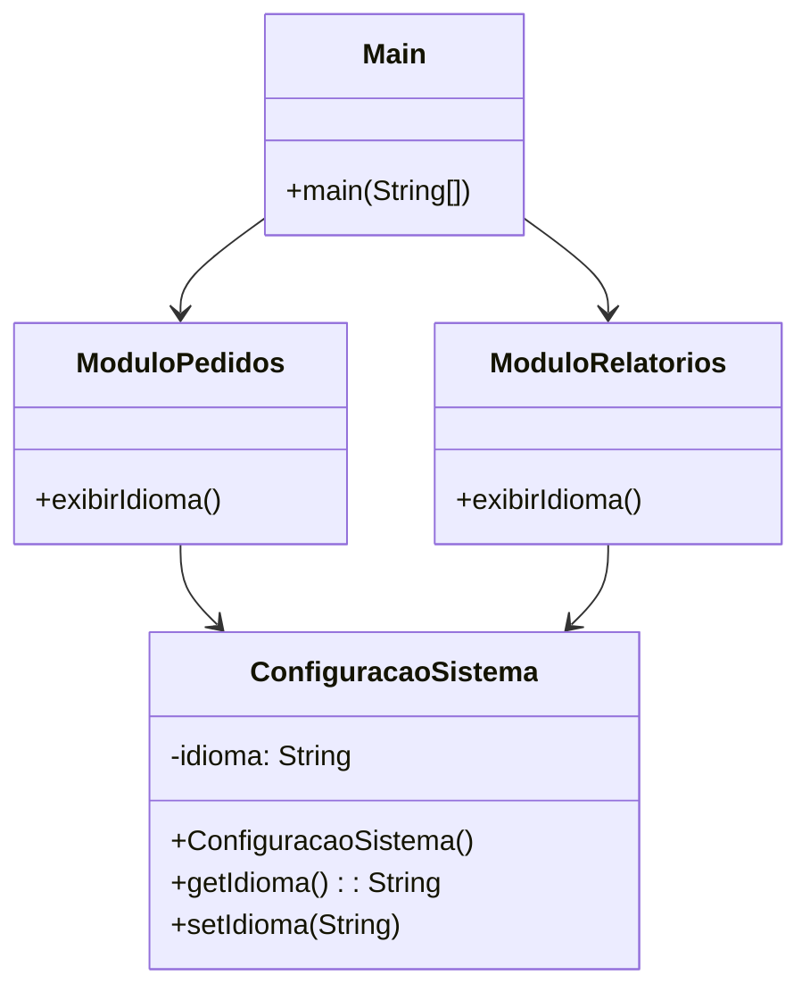
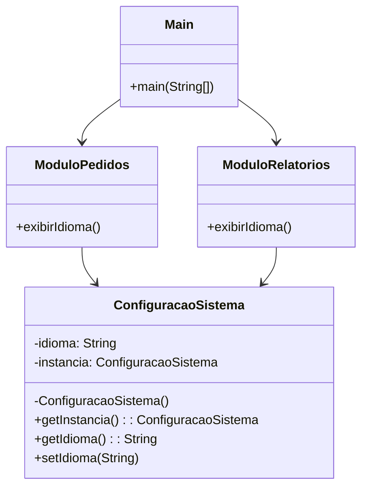

## Padrão de Projeto: Singleton

---

### 🎯 Objetivo da Aula

Apresentar o padrão **Singleton**, explorando seu contexto, estrutura, implementação, vantagens e limitações — comparando a versão com e sem padrão.

---

## 🤔 Problema

Imagine um sistema que possui **múltiplos módulos** (ex: Módulo de Pedidos, Módulo de Relatórios), todos dependendo de configurações globais como idioma, moeda ou ambiente de execução. Como garantir que todos esses módulos compartilhem a **mesma instância de configuração**, sem risco de inconsistências?

---

## ❌ Versão Ruim (Sem Singleton)

Cada parte do sistema instancia sua própria configuração, o que gera múltiplas versões conflitantes de um mesmo conceito.

### 🔧 Código Java

```java
public class ConfiguracaoSistema {
    private String idioma;

    public ConfiguracaoSistema() {
        this.idioma = "pt-BR";
    }

    public String getIdioma() {
        return idioma;
    }

    public void setIdioma(String idioma) {
        this.idioma = idioma;
    }
}

public class ModuloPedidos {
    public void exibirIdioma() {
        ConfiguracaoSistema config = new ConfiguracaoSistema();
        System.out.println("Módulo Pedidos - Idioma: " + config.getIdioma());
    }
}

public class ModuloRelatorios {
    public void exibirIdioma() {
        ConfiguracaoSistema config = new ConfiguracaoSistema();
        System.out.println("Módulo Relatórios - Idioma: " + config.getIdioma());
    }
}

public class Main {
    public static void main(String[] args) {
        ModuloPedidos pedidos = new ModuloPedidos();
        ModuloRelatorios relatorios = new ModuloRelatorios();

        pedidos.exibirIdioma();
        relatorios.exibirIdioma();
    }
}
```

### 📉 Problema:

Cada módulo cria sua própria instância, e mudanças feitas em uma **não afetam** a outra.

---

### 📦 Diagrama (Sem Singleton)



---

## ✅ Solução com Singleton

### 🧠 Estratégia:

Centralizamos o controle de criação da instância dentro da própria classe, garantindo **uma única instância compartilhada**.

### 🔧 Código Java:

```java
public class ConfiguracaoSistema {
    private static ConfiguracaoSistema instancia;
    private String idioma;

    private ConfiguracaoSistema() {
        this.idioma = "pt-BR";
    }

    public static ConfiguracaoSistema getInstancia() {
        if (instancia == null) {
            instancia = new ConfiguracaoSistema();
        }
        return instancia;
    }

    public String getIdioma() {
        return idioma;
    }

    public void setIdioma(String idioma) {
        this.idioma = idioma;
    }
}

public class ModuloPedidos {
    public void exibirIdioma() {
        ConfiguracaoSistema config = ConfiguracaoSistema.getInstancia();
        System.out.println("Módulo Pedidos - Idioma: " + config.getIdioma());
    }
}

public class ModuloRelatorios {
    public void exibirIdioma() {
        ConfiguracaoSistema config = ConfiguracaoSistema.getInstancia();
        System.out.println("Módulo Relatórios - Idioma: " + config.getIdioma());
    }
}

public class Main {
    public static void main(String[] args) {
        ConfiguracaoSistema.getInstancia().setIdioma("en-US");

        ModuloPedidos pedidos = new ModuloPedidos();
        ModuloRelatorios relatorios = new ModuloRelatorios();

        pedidos.exibirIdioma();       // en-US
        relatorios.exibirIdioma();    // en-US
    }
}
```

---

### 📦 Diagrama (Com Singleton)



---

## ✅ Vantagens

* **Controle total** sobre a única instância.
* **Compartilhamento fácil** de dados globais.
* **Economia de recursos** (não cria múltiplos objetos desnecessários).

---

## ❌ Desvantagens

* **Difícil de testar** (difícil substituir a instância por mocks).
* **Aumenta acoplamento global** entre classes.
* **Possível problema com multithread** se não protegido (ex: em aplicações web).

---

## 🔄 Alternativas

* Usar frameworks de **injeção de dependência** (como Spring).
* Em Java, usar `enum` Singleton (forma mais segura em multithread).

---

## 📚 Referências

* *Padrões de Projeto* (GoF)
* [Refactoring.Guru – Singleton](https://refactoring.guru/pt-br/design-patterns/singleton)
