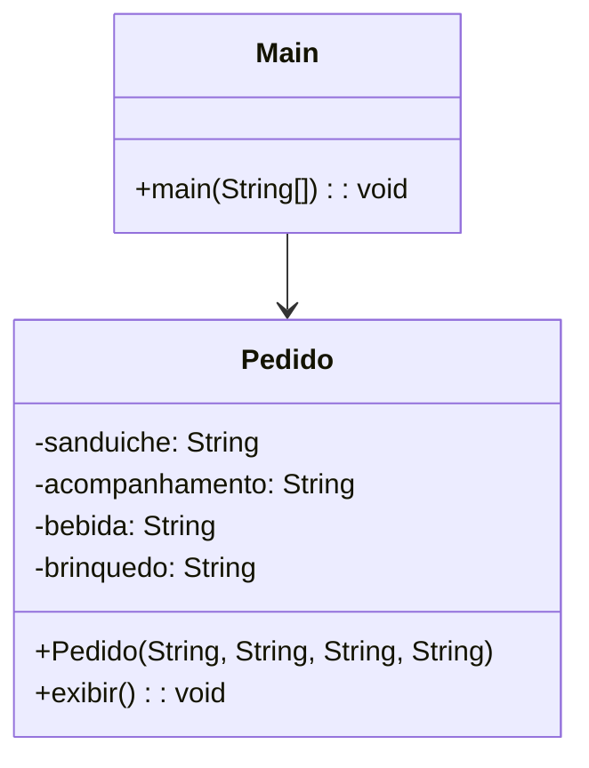
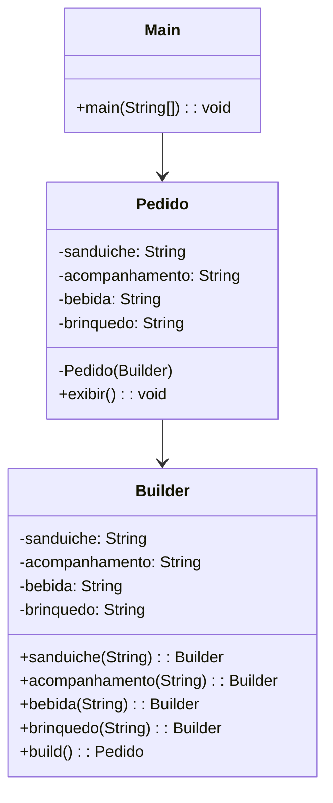

# Aula – Builder

## Padrão de Projeto: **Builder**

> 📅 Sugestão: Aula para **quarta-feira, 04/06/2025**

---

## 🎯 Objetivo

Entender como o padrão **Builder** pode ser usado para criar objetos complexos de forma controlada e legível, separando a construção do objeto da sua representação.

---

## 🤔 Problema

Imagine que você precisa montar um **pedido de lanche** para um sistema de fast food.

Cada pedido pode conter:

* Um **sanduíche** (com ou sem queijo, alface, tipo de carne etc.)
* Um **acompanhamento** (batata, salada, nuggets)
* Uma **bebida** (refrigerante, suco, água)
* Um **brinquedo** (opcional)

Agora imagine que, dependendo do tipo do cliente (adulto, infantil, vegetariano...), os pedidos mudam. Como evitar **construtores enormes**, com **parâmetros opcionais**, difíceis de manter e confusos de usar?

---

## ❌ Solução sem Builder (Ruim)

A abordagem sem o padrão Builder exige que o construtor receba todos os dados, mesmo os opcionais, ou use setters que deixam o objeto incompleto e propenso a erros.

### Código Java

```java
public class Pedido {
    private String sanduiche;
    private String acompanhamento;
    private String bebida;
    private String brinquedo;

    public Pedido(String sanduiche, String acompanhamento, String bebida, String brinquedo) {
        this.sanduiche = sanduiche;
        this.acompanhamento = acompanhamento;
        this.bebida = bebida;
        this.brinquedo = brinquedo;
    }

    public void exibir() {
        System.out.println("Pedido:");
        System.out.println("Sanduíche: " + sanduiche);
        System.out.println("Acompanhamento: " + acompanhamento);
        System.out.println("Bebida: " + bebida);
        System.out.println("Brinquedo: " + (brinquedo != null ? brinquedo : "Nenhum"));
    }
}

public class Main {
    public static void main(String[] args) {
        Pedido pedido1 = new Pedido("Cheeseburger", "Batata", "Refrigerante", null);
        Pedido pedido2 = new Pedido("Veggie", "Salada", "Suco", "Boneco");

        pedido1.exibir();
        pedido2.exibir();
    }
}
```

### ❗ Problemas

* **Difícil de ler e entender** o que cada parâmetro representa.
* Se você quiser mudar a ordem dos parâmetros ou torná-los opcionais, o código se torna confuso.
* Reutilização de combinações exige muita repetição.

---

### Diagrama (Sem Builder)



---

## ✅ Solução com Builder

### 🧠 Estratégia:

Criamos uma classe auxiliar (Builder) que **monta** o objeto `Pedido` passo a passo, com métodos fluentes. O objeto só é criado ao final, com `build()`.

---

### Código Java

```java
public class Pedido {
    private String sanduiche;
    private String acompanhamento;
    private String bebida;
    private String brinquedo;

    private Pedido(Builder builder) {
        this.sanduiche = builder.sanduiche;
        this.acompanhamento = builder.acompanhamento;
        this.bebida = builder.bebida;
        this.brinquedo = builder.brinquedo;
    }

    public void exibir() {
        System.out.println("Pedido:");
        System.out.println("Sanduíche: " + sanduiche);
        System.out.println("Acompanhamento: " + acompanhamento);
        System.out.println("Bebida: " + bebida);
        System.out.println("Brinquedo: " + (brinquedo != null ? brinquedo : "Nenhum"));
    }

    public static class Builder {
        private String sanduiche;
        private String acompanhamento;
        private String bebida;
        private String brinquedo;

        public Builder sanduiche(String sanduiche) {
            this.sanduiche = sanduiche;
            return this;
        }

        public Builder acompanhamento(String acompanhamento) {
            this.acompanhamento = acompanhamento;
            return this;
        }

        public Builder bebida(String bebida) {
            this.bebida = bebida;
            return this;
        }

        public Builder brinquedo(String brinquedo) {
            this.brinquedo = brinquedo;
            return this;
        }

        public Pedido build() {
            return new Pedido(this);
        }
    }
}
```

---

### Main

```java
public class Main {
    public static void main(String[] args) {
        Pedido pedido1 = new Pedido.Builder()
            .sanduiche("Cheeseburger")
            .acompanhamento("Batata")
            .bebida("Refrigerante")
            .build();

        Pedido pedido2 = new Pedido.Builder()
            .sanduiche("Veggie")
            .acompanhamento("Salada")
            .bebida("Suco")
            .brinquedo("Boneco")
            .build();

        pedido1.exibir();
        pedido2.exibir();
    }
}
```

---

### Diagrama (Com Builder)



---

## ✅ Vantagens

* Separação entre **criação** e **representação**.
* Mais **leitura fluente** e clara.
* Evita **construtores com muitos parâmetros**.
* Permite **validação antes da criação** (`build()`).

---

## ❌ Desvantagens

* Aumenta o número de classes.
* Pode ser exagerado para objetos simples.

---

## 📚 Quando Usar

* Objetos com **muitos atributos opcionais**.
* Objetos imutáveis (quando não há setters).
* Para melhorar **legibilidade e segurança** na construção.

---

## 📚 Referências

* *Design Patterns – GoF*
* [Refactoring.Guru – Builder](https://refactoring.guru/pt-br/design-patterns/builder)
