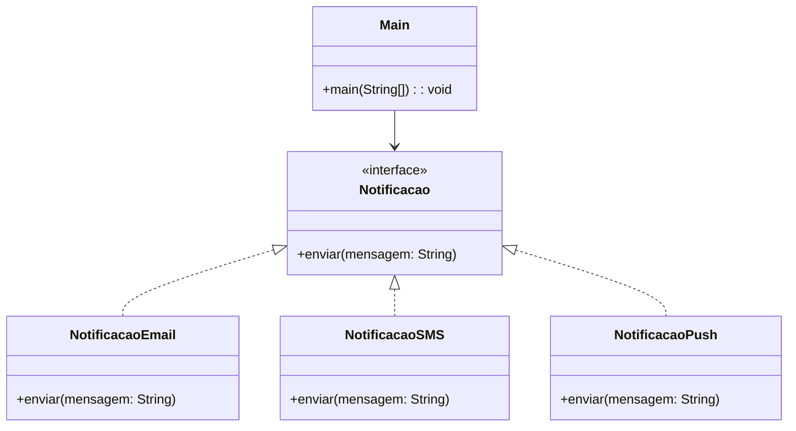
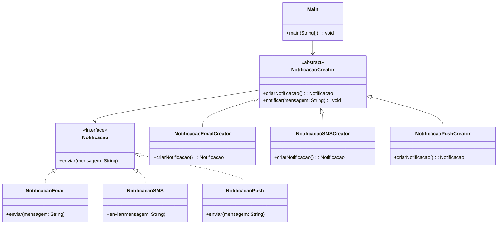

# Aula – Factory Method

## Padrão de Projeto: **Factory Method**

> 📅 Sugestão: Aula para **quarta-feira, 04/06/2025**

---

## 🎯 Objetivo

Compreender como o padrão **Factory Method** permite a criação de objetos sem acoplar diretamente o código cliente às classes concretas, favorecendo a extensão e o polimorfismo.

---

## 🤔 Problema

Imagine um **sistema de notificações** que precisa enviar mensagens por diferentes meios:

* Email
* SMS
* Notificação Push

Hoje o sistema funciona com notificações por email, mas a empresa quer incluir outras formas de comunicação, e você precisa que isso seja feito sem alterar o código principal do sistema sempre que um novo tipo de notificação for adicionado.

---

## ❌ Solução sem Factory Method (Ruim)

Na solução sem o padrão, o código principal depende diretamente de classes concretas. Isso viola o **Princípio Aberto/Fechado (OCP)** e gera muitos `if` ou `switch`.
> O código **não está fechado para modificação**. Sempre que um novo tipo de notificação for criado, é preciso **editar o código existente**, o que aumenta o risco de bugs.

---

### Código Java (sem Factory Method)

```java
public interface Notificacao {
    void enviar(String mensagem);
}

public class NotificacaoEmail implements Notificacao {
    public void enviar(String mensagem) {
        System.out.println("Enviando por EMAIL: " + mensagem);
    }
}

public class NotificacaoSMS implements Notificacao {
    public void enviar(String mensagem) {
        System.out.println("Enviando por SMS: " + mensagem);
    }
}

public class NotificacaoPush implements Notificacao {
    public void enviar(String mensagem) {
        System.out.println("Enviando por PUSH: " + mensagem);
    }
}

public class Main {
    public static void main(String[] args) {
        String tipo = "sms"; // simula entrada do usuário
        Notificacao notificacao;

        if (tipo.equals("email")) {
            notificacao = new NotificacaoEmail();
        } else if (tipo.equals("sms")) {
            notificacao = new NotificacaoSMS();
        } else if (tipo.equals("push")) {
            notificacao = new NotificacaoPush();
        } else {
            throw new IllegalArgumentException("Tipo inválido");
        }

        notificacao.enviar("Bem-vindo ao sistema!");
    }
}
```

---

### ❗ Problemas

* O código principal precisa conhecer **todas** as classes concretas.
* A cada nova notificação, você **altera** o `main`.
* Quebra o princípio da **abertura para extensão e fechamento para modificação** (OCP).

---

### Diagrama (Sem Factory Method)



---

## ✅ Solução com Factory Method

### 🧠 Estratégia

Criamos uma **fábrica abstrata (`NotificacaoCreator`)** com o método `criarNotificacao()`. As subclasses decidem **qual tipo concreto criar**.

---

### Código Java (com Factory Method)

```java
// Interface do produto
public interface Notificacao {
    void enviar(String mensagem);
}

// Produtos concretos
public class NotificacaoEmail implements Notificacao {
    public void enviar(String mensagem) {
        System.out.println("Enviando por EMAIL: " + mensagem);
    }
}

public class NotificacaoSMS implements Notificacao {
    public void enviar(String mensagem) {
        System.out.println("Enviando por SMS: " + mensagem);
    }
}

public class NotificacaoPush implements Notificacao {
    public void enviar(String mensagem) {
        System.out.println("Enviando por PUSH: " + mensagem);
    }
}
```

---

### Fábrica abstrata e criadores concretos

```java
// Creator (classe abstrata ou interface)
public abstract class NotificacaoCreator {
    public abstract Notificacao criarNotificacao();

    public void notificar(String mensagem) {
        Notificacao notificacao = criarNotificacao();
        notificacao.enviar(mensagem);
    }
}

// Concrete Creators
public class NotificacaoEmailCreator extends NotificacaoCreator {
    public Notificacao criarNotificacao() {
        return new NotificacaoEmail();
    }
}

public class NotificacaoSMSCreator extends NotificacaoCreator {
    public Notificacao criarNotificacao() {
        return new NotificacaoSMS();
    }
}

public class NotificacaoPushCreator extends NotificacaoCreator {
    public Notificacao criarNotificacao() {
        return new NotificacaoPush();
    }
}
```

---

### Main

```java
public class Main {
    public static void main(String[] args) {
        String tipo = "push"; // simula entrada do usuário
        NotificacaoCreator creator;

        switch (tipo) {
            case "email":
                creator = new NotificacaoEmailCreator();
                break;
            case "sms":
                creator = new NotificacaoSMSCreator();
                break;
            case "push":
                creator = new NotificacaoPushCreator();
                break;
            default:
                throw new IllegalArgumentException("Tipo inválido");
        }

        creator.notificar("Bem-vindo ao sistema!");
    }
}
```

---

### Diagrama (Com Factory Method)



---

## ✅ Vantagens

* O cliente depende de uma **interface ou classe abstrata**, não das implementações concretas.
* **Fácil de estender**: novas notificações requerem apenas nova subclasse da fábrica.
* Segue os princípios **OCP** e **DIP** (Inversão de Dependência).

---

## ❌ Desvantagens

* Introduz mais classes no projeto.
* Levemente mais complexo para objetos simples.

---

## 🧠 Quando Usar

* Quando você quer delegar a criação de objetos para subclasses.
* Quando o sistema precisa ser **extensível**, com tipos de objetos a serem definidos futuramente.
* Quando se deseja aplicar o **princípio da inversão de dependência**.

---

## 📐 Sobre o Princípio Aberto/Fechado (OCP)

> O OCP é um dos princípios do SOLID, que propõe:
>
> **"Entidades de software (classes, módulos, funções, etc.) devem estar abertas para extensão, mas fechadas para modificação."**

### Em outras palavras:

* Você deve poder **adicionar novos comportamentos** ao sistema **sem alterar** o código já existente.
* Isso evita erros acidentais e torna o sistema mais **manutenível** e **escalável**.

### Como o Factory Method aplica o OCP?

* A lógica de criação de objetos fica nas subclasses (`NotificacaoXCreator`), e o código cliente (`Main`) **não precisa ser alterado** para adicionar novos tipos de notificações.
* Basta **criar uma nova classe** implementando a fábrica.

---

## 📚 Referências

* *Design Patterns – GoF*
* [Refactoring.Guru – Factory Method](https://refactoring.guru/pt-br/design-patterns/factory-method)

---

Se quiser, posso gerar um desafio prático para os alunos aplicarem o Factory Method. Deseja?
