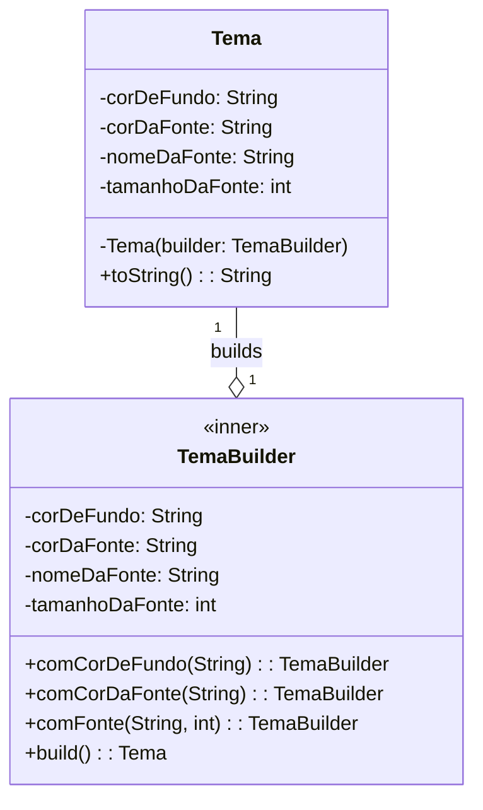
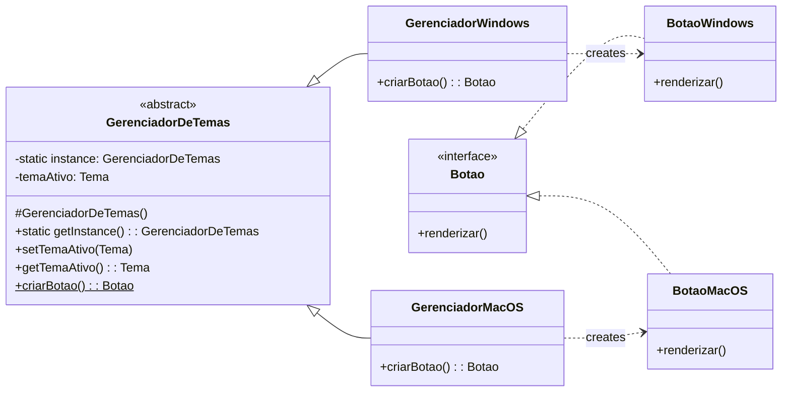

### **Guia Completo da Atividade Prática (11/06): Sistema de Gerenciamento de Temas de UI**

#### **🎯 Objetivo**
Consolidar o uso dos padrões **Singleton**, **Builder** e **Factory Method**, implementando uma solução do zero a partir de um guia descritivo para resolver um problema prático.

#### **📜 Cenário do Problema**
Estamos construindo uma aplicação desktop e precisamos de um sistema para gerenciar temas visuais (cores, fontes). O sistema deve permitir a criação de temas complexos, garantir que haja um único gerenciador central e ser capaz de criar componentes de UI (como botões) que reflitam o tema ativo e o sistema operacional.

---

### **1. Visão Geral da Arquitetura**

Antes de programar, vamos visualizar a solução. A arquitetura que vamos construir seguirá os diagramas abaixo.

**Diagrama 1: A Construção do Objeto `Tema` com o Padrão Builder**


**Diagrama 2: A Fábrica de Componentes com Singleton e Factory Method**


---

### **2. Tutorial de Implementação Passo a Passo**

Siga as instruções abaixo para criar cada uma das classes do sistema.

#### **Passo 1.1: A Classe `Tema` e seu `Builder` (Padrão Builder)**
Nesta etapa, você criará a classe `Tema` e sua construtora `TemaBuilder`.

* **Na classe `Tema`:**
    * Declare os atributos para as configurações visuais (`corDeFundo`, `corDaFonte`, etc.) como `private` e `final` para garantir que um tema seja imutável após sua criação.
    * Crie um construtor `private` que receba um `TemaBuilder` como parâmetro. A lógica deste construtor é simples: inicializar os atributos da classe `Tema` com os valores que estão no objeto `builder` recebido.
    * Crie os métodos `get()` para cada atributo.
    * Sobrescreva o método `toString()` para uma visualização amigável do tema.

* **Na classe `TemaBuilder`:**
    * Crie-a como uma `public static class` aninhada dentro da classe `Tema`.
    * Declare os mesmos atributos que existem na classe `Tema`, mas desta vez eles não serão `final`.
    * Para cada atributo, crie um método "fluente" (ex: `public TemaBuilder comCorDeFundo(String cor)`). Este método deve atribuir o valor ao atributo correspondente do builder e, crucialmente, retornar `this` para permitir o encadeamento das chamadas.
    * Crie um método final `public Tema build()`. A responsabilidade dele é invocar o construtor privado de `Tema`, passando a si mesmo (`new Tema(this)`), e retornar o objeto `Tema` recém-criado.

#### **Passo 1.2: A Interface `Botao` e suas Implementações**
Aqui você definirá o "produto" que nossa fábrica irá criar.

* **Crie a interface `Botao`:** Ela deve declarar um único método: `void renderizar();`.
* **Crie as classes concretas `BotaoWindows` e `BotaoMacOS`:**
    * Ambas devem implementar a interface `Botao`.
    * Cada classe deve ter atributos `private` e `final` para armazenar as propriedades do tema que ela receberá (ex: `corDeFundo`, `corDaFonte`).
    * Crie um construtor público em cada uma que receba e inicialize esses atributos.
    * Implemente o método `renderizar()`. A implementação deve imprimir uma mensagem no console que mostre tanto o estilo do botão (Windows ou MacOS) quanto os valores das propriedades do tema que ele armazenou.

#### **Passo 1.3: O `GerenciadorDeTemas` e suas Fábricas (Singleton + Factory Method)**
Esta é a classe orquestradora do nosso sistema.

* **Crie a classe `GerenciadorDeTemas` como `abstract`:**
    * Declare um atributo `protected Tema temaAtivo` para armazenar o tema atualmente em uso.
    * Crie os métodos públicos `setTemaAtivo(Tema tema)` e `getTemaAtivo()` para manipular este atributo.
    * Declare o **Factory Method** como um método abstrato: `public abstract Botao criarBotao();`.

* **Crie as classes concretas `GerenciadorWindows` e `GerenciadorMacOS`:**
    * Ambas devem herdar de `GerenciadorDeTemas`.
    * **Implemente o padrão Singleton em cada uma delas:** Crie um atributo `private static` para a instância, um construtor `private` para evitar instanciação externa, e um método `public static getInstance()` que retorna a instância única da classe.
    * **Implemente o Factory Method `criarBotao()`:** Este método é o coração da fábrica. Sua lógica deve ser:
        1.  Obter o tema ativo chamando o método `getTemaAtivo()` (herdado da classe pai).
        2.  Verificar se o tema não é nulo.
        3.  Instanciar o botão concreto correspondente (`new BotaoWindows(...)` ou `new BotaoMacOS(...)`), passando para o construtor dele as propriedades extraídas do objeto `temaAtivo`.
        4.  Retornar o botão recém-criado.

---

### **3. Código de Validação (`Main.java`)**

Após implementar todas as classes acima, utilize o código abaixo para executar e validar sua solução. Ele não deve precisar de nenhuma alteração se sua implementação estiver correta.

```java
public class Main {
    public static void main(String[] args) {

        System.out.println("### Etapa 1: Usando o Builder para criar objetos Tema complexos ###");
        Tema temaEscuro = new Tema.TemaBuilder()
                .comCorDeFundo("#2d2d2d")
                .comCorDaFonte("#e0e0e0")
                .comFonte("Consolas", 14)
                .build();

        Tema temaClaro = new Tema.TemaBuilder()
                .comCorDeFundo("#fafafa")
                .comCorDaFonte("#333333")
                .comFonte("Arial", 12)
                .build();
        System.out.println("Temas criados com sucesso.\n");


        System.out.println("### Etapa 2: Configurando o Gerenciador (Singleton) e usando a Fábrica (Factory Method) ###");
        GerenciadorDeTemas gerenciador = GerenciadorWindows.getInstance();

        // ---- Teste com Tema Escuro ----
        System.out.println("\n--- Usando o Tema Escuro ---");
        gerenciador.setTemaAtivo(temaEscuro);

        Botao botaoEscuro = gerenciador.criarBotao();
        System.out.print("--> Resultado: ");
        botaoEscuro.renderizar();

        // ---- Teste com Tema Claro ----
        System.out.println("\n--- Usando o Tema Claro ---");
        gerenciador.setTemaAtivo(temaClaro);

        Botao botaoClaro = gerenciador.criarBotao();
        System.out.print("--> Resultado: ");
        botaoClaro.renderizar();
    }
}
```

#### **Resultado Esperado no Console:**

```
### Etapa 1: Usando o Builder para criar objetos Tema complexos ###
Temas criados com sucesso.

### Etapa 2: Configurando o Gerenciador (Singleton) e usando a Fábrica (Factory Method) ###

--- Usando o Tema Escuro ---
--> Resultado: Renderizando Botao estilo Windows | Fundo: #2d2d2d, Fonte: #e0e0e0

--- Usando o Tema Claro ---
--> Resultado: Renderizando Botao estilo Windows | Fundo: #fafafa, Fonte: #333333
```

---

#### Entrega

Uma pessoa da equipe deve entregar os arquivos da classe na atividade do Classroom ou um link para o GitHub.
Além disso, informar o nome da equipe na descrição.

A atividade valerá 1,0 ponto extra na Unidade 2.
