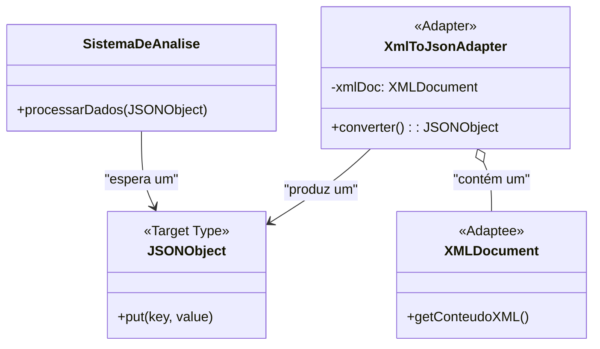

### **Aula – Padrão de Projeto: Adapter (Adaptador)**

#### **🎯 Objetivo da Aula**
Compreender como o padrão **Adapter** permite a integração de componentes com interfaces incompatíveis, usando um exemplo prático de manipulação de dados em diferentes formatos (XML e JSON).

---

#### **🤔 O Problema: Integrando um Sistema Legado**

Imagine que estamos trabalhando em um sistema moderno de análise de dados. Nosso sistema é projetado para receber e processar dados no formato **JSON**. Temos uma classe de serviço com um método que espera um objeto `JSONObject`:

```java
// Nosso sistema moderno espera receber um JSONObject
public class SistemaDeAnalise {
    public void processarDados(JSONObject dadosJson) {
        System.out.println("Processando os seguintes dados no sistema novo:");
        System.out.println(dadosJson.toString(4)); // Imprime o JSON formatado
    }
}
```
*(Para este exemplo, vamos supor que `JSONObject` é uma classe de uma biblioteca popular como `org.json`)*

Agora, surge um desafio: precisamos importar dados de um sistema de RH muito antigo. Esse sistema legado só consegue exportar os dados de funcionários em formato **XML**.

```xml
<funcionario>
    <nome>João da Silva</nome>
    <cargo>Desenvolvedor</cargo>
</funcionario>
```

Temos uma biblioteca que consegue ler essa string XML e transformá-la em um objeto `XMLDocument`, mas a interface desse objeto é totalmente diferente da do `JSONObject`.

```java
// Objeto que representa os dados do sistema legado (nosso "Adaptado")
public class XMLDocument {
    private String conteudo;
    public XMLDocument(String conteudo) { this.conteudo = conteudo; }
    public String getConteudoXML() { return this.conteudo; }
    // ... outros métodos para manipular XML, como getElementById(), etc.
}
```

**O conflito é claro:** nosso `SistemaDeAnalise` não pode processar um `XMLDocument` diretamente.

```java
public static void main(String[] args) {
    String dadosEmXml = "<funcionario>...</funcionario>";
    XMLDocument xml = new XMLDocument(dadosEmXml);
    SistemaDeAnalise sistema = new SistemaDeAnalise();
    
    sistema.processarDados(xml); // ERRO DE COMPILAÇÃO!
    // O método espera JSONObject, mas recebeu XMLDocument.
}
```
Como podemos fazer esses dois sistemas conversarem sem ter que alterar nosso `SistemaDeAnalise` (o que violaria o Princípio Aberto/Fechado)?

---

### **💡 A Solução: O Adaptador de XML para JSON**

Criaremos uma classe **Adapter** que atuará como um conversor. A responsabilidade dela será "pegar" o objeto `XMLDocument` e "traduzi-lo" para o formato `JSONObject` que nosso sistema entende.

#### **🔧 Como Implementar o Adapter**

1.  Criamos a classe `XmlToJsonAdapter`.
2.  Ela receberá um `XMLDocument` em seu construtor.
3.  Ela terá um método, como `converter()`, que fará a lógica de ler os dados do XML e criar um novo `JSONObject` com eles.

**Código do Adaptador:**
```java
// Adaptador que converte XMLDocument para JSONObject
public class XmlToJsonAdapter {
    private XMLDocument xmlDoc;

    public XmlToJsonAdapter(XMLDocument xmlDoc) {
        this.xmlDoc = xmlDoc;
    }

    public JSONObject converter() {
        // --- Lógica de conversão simplificada ---
        // Em um caso real, usaríamos uma biblioteca de parsing de XML (ex: JAXB, DOM).
        // Aqui, vamos apenas simular a extração dos dados.
        String xml = xmlDoc.getConteudoXML();
        String nome = extrairValor(xml, "nome"); // Simula a extração
        String cargo = extrairValor(xml, "cargo"); // Simula a extração

        JSONObject json = new JSONObject();
        json.put("nome", nome);
        json.put("cargo", cargo);
        
        System.out.println("Adaptador converteu XML para JSON com sucesso!");
        return json;
    }
    
    // Método auxiliar apenas para o exemplo
    private String extrairValor(String xml, String tag) {
        try {
            return xml.split("<"+tag+">")[1].split("</"+tag+">")[0];
        } catch (Exception e) {
            return "";
        }
    }
}
```

#### **🔌 Usando o Adaptador**
Agora, o código cliente usa o adaptador para fazer a "ponte" entre os dois sistemas:

```java
public static void main(String[] args) {
    // 1. Dados vêm do sistema legado
    String dadosEmXml = "<funcionario><nome>João da Silva</nome><cargo>Desenvolvedor</cargo></funcionario>";
    XMLDocument xml = new XMLDocument(dadosEmXml);

    // 2. Criamos o adaptador, envolvendo o objeto incompatível
    XmlToJsonAdapter adaptador = new XmlToJsonAdapter(xml);

    // 3. Usamos o adaptador para obter os dados no formato que nosso sistema espera
    JSONObject dadosJson = adaptador.converter();

    // 4. Agora podemos passar os dados convertidos para o nosso sistema!
    SistemaDeAnalise sistema = new SistemaDeAnalise();
    sistema.processarDados(dadosJson);
}
```
**Saída no console:**
```
Adaptador converteu XML para JSON com sucesso!
Processando os seguintes dados no sistema novo:
{
    "nome": "João da Silva",
    "cargo": "Desenvolvedor"
}
```

---

### **📊 Diagrama de Classes da Solução**

Este diagrama mostra como o `XmlToJsonAdapter` atua como intermediário, consumindo um `XMLDocument` e produzindo um `JSONObject`.



---

### **✅ Vantagens e Desvantagens**

* **Vantagens:**
    * **Reutilização e Integração:** Permite usar componentes e sistemas legados sem alterar seu código.
    * **Baixo Acoplamento:** O sistema cliente (`SistemaDeAnalise`) não precisa saber da existência do `XMLDocument` ou do adaptador. Ele continua dependendo apenas do formato `JSONObject`.
    * **Princípio da Responsabilidade Única:** A lógica complexa de conversão de dados fica totalmente encapsulada dentro da classe adaptadora.

* **Desvantagens:**
    * **Aumento de Classes:** Adiciona uma classe intermediária para cada adaptação, o que pode, em alguns casos, aumentar a complexidade geral do código.

---

### **🤔 Quando Usar?**

* **Integração de Sistemas:** O caso de uso mais comum. Quando você precisa que seu sistema converse com outro que usa uma API ou formato de dados diferente.
* **Uso de Bibliotecas de Terceiros:** Para "traduzir" a interface de uma biblioteca externa para a interface padrão usada em sua aplicação.
* **Refatoração:** Durante uma refatoração, você pode criar adaptadores para fazer a transição gradual de um sistema antigo para um novo, permitindo que ambos coexistam por um tempo.