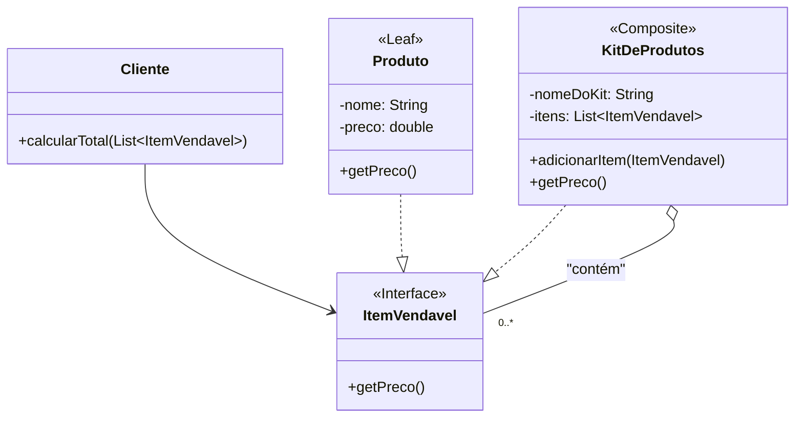

### **Aula – Padrão de Projeto: Composite**

#### **🎯 Objetivo da Aula**

Compreender como o padrão **Composite** permite tratar tanto objetos individuais (folhas) quanto composições de objetos (grupos) de maneira uniforme, usando um catálogo de produtos de e-commerce como exemplo.

-----

#### **🤔 O Problema: Calculando o Preço de um Carrinho de Compras**

Imagine que estamos desenvolvendo o sistema de um e-commerce. Nossa loja vende dois tipos de coisas:

1.  **Produtos Individuais:** Um item com seu próprio preço, como um "Teclado Mecânico" (R$ 300) ou um "Mouse Gamer" (R$ 150).
2.  **Kits de Produtos:** Um pacote que agrupa outros itens. Por exemplo, um "Kit Gamer Básico" que contém um Teclado e um Mouse. O preço do kit é a soma dos preços de seus componentes. Um kit pode, inclusive, conter outros kits.

O desafio surge quando um cliente adiciona vários itens ao carrinho de compras, misturando produtos individuais e kits. Como calculamos o valor total do carrinho de forma simples e elegante?

**❌ A Solução sem um Padrão (Complexa e Não Uniforme):**

Sem um padrão, teríamos classes distintas como `Produto` e `KitDeProdutos`. Para calcular o total do carrinho, nosso código teria que fazer uma distinção manual entre os tipos de item:

```java
public double calcularTotal(List<Object> itens) {
    double total = 0;
    for (Object item : itens) {
        if (item instanceof Produto) {
            // Lógica para somar o preço de um Produto
            total += ((Produto) item).getPreco();
        } else if (item instanceof KitDeProdutos) {
            // Lógica diferente para somar o preço de um Kit
            total += ((KitDeProdutos) item).getPrecoTotalDoKit(); // Método com nome diferente!
        }
    }
    return total;
}
```

**❗ Problemas desta Abordagem:**

* **Código Cliente Complexo:** O cliente precisa saber de todos os tipos de itens vendáveis e tratá-los de forma diferente, usando `instanceof` e type casting.
* **Difícil Manutenção:** Se criarmos um novo tipo de pacote, como "Caixa Misteriosa", teremos que alterar o método `calcularTotal` em todos os lugares onde ele é usado. Isso viola o Princípio Aberto/Fechado.

-----

### **💡 A Solução: Todo Item Vendável é um "Componente"**

O padrão **Composite** nos permite tratar todos os itens, sejam eles produtos individuais ou kits, através de uma única interface comum, que chamaremos de **Componente**.

#### **🔧 Como Implementar o Composite**

1.  **Criar a Interface Componente:** `ItemVendavel`, que define a operação comum para todos: `getPreco()`.
2.  **Criar a Classe Folha (Leaf):** A classe `Produto` implementa `ItemVendavel`. O método `getPreco()` simplesmente retorna seu próprio valor.
3.  **Criar a Classe Compósito (Composite):** A classe `KitDeProdutos` também implementa `ItemVendavel`. Ela contém uma lista de outros `ItemVendavel` e seu método `getPreco()` calcula a soma dos preços de seus filhos.

**Passo 1: A Interface Comum (Componente)**

```java
// O Componente: define a operação comum para folhas e compósitos.
public interface ItemVendavel {
    double getPreco();
}
```

**Passo 2: A Classe Folha (Leaf)**
Representa um produto individual.

```java
// A Folha (Leaf): um objeto individual na composição.
public class Produto implements ItemVendavel {
    private String nome;
    private double preco;

    public Produto(String nome, double preco) {
        this.nome = nome;
        this.preco = preco;
    }

    @Override
    public double getPreco() {
        System.out.println("Calculando preço do produto: " + nome + " (R$ " + preco + ")");
        return this.preco;
    }
}
```

**Passo 3: A Classe Compósito (Composite)**
Representa um kit que agrupa outros itens.

```java
import java.util.ArrayList;
import java.util.List;

// O Compósito (Composite): armazena outros ItemVendavel.
public class KitDeProdutos implements ItemVendavel {
    private String nomeDoKit;
    private List<ItemVendavel> itens = new ArrayList<>();

    public KitDeProdutos(String nomeDoKit) {
        this.nomeDoKit = nomeDoKit;
    }

    public void adicionarItem(ItemVendavel item) {
        itens.add(item);
    }

    @Override
    public double getPreco() {
        System.out.println("Calculando preço do kit: " + nomeDoKit);
        // A mágica da recursão: delega o cálculo para os filhos.
        double precoTotal = 0;
        for (ItemVendavel item : itens) {
            precoTotal += item.getPreco();
        }
        return precoTotal;
    }
}
```

#### **🛒 Montando e Calculando o Preço do Carrinho**

O código cliente agora pode montar o carrinho com diferentes tipos de itens e calcular o total de forma uniforme, sem se preocupar com os tipos.

```java
import java.util.ArrayList;
import java.util.List;

public class MainLoja {
    public static void main(String[] args) {
        // Criando produtos individuais
        Produto teclado = new Produto("Teclado Mecânico", 350.00);
        Produto mouse = new Produto("Mouse Gamer RGB", 150.00);
        Produto headset = new Produto("Headset 7.1", 400.00);
        Produto monitor = new Produto("Monitor Ultrawide", 1800.00);

        // Criando um kit composto por outros itens
        KitDeProdutos kitGamer = new KitDeProdutos("Kit Gamer Essencial");
        kitGamer.adicionarItem(teclado);
        kitGamer.adicionarItem(mouse);
        kitGamer.adicionarItem(headset);

        // Montando o carrinho de compras com itens individuais e kits
        List<ItemVendavel> carrinho = new ArrayList<>();
        carrinho.add(monitor);       // Adicionando um produto individual
        carrinho.add(kitGamer);      // Adicionando um kit

        // Calculando o total do carrinho de forma uniforme
        double totalCarrinho = 0;
        System.out.println("--- Calculando Total do Carrinho ---");
        for (ItemVendavel item : carrinho) {
            totalCarrinho += item.getPreco(); // O cliente não precisa saber o tipo do item!
            System.out.println("Subtotal parcial: R$ " + totalCarrinho);
            System.out.println("--------------------");
        }

        System.out.println("\nVALOR TOTAL DO CARRINHO: R$ " + totalCarrinho);
    }
}
```

**Saída no console:**

```
--- Calculando Total do Carrinho ---
Calculando preço do produto: Monitor Ultrawide (R$ 1800.0)
Subtotal parcial: R$ 1800.0
--------------------
Calculando preço do kit: Kit Gamer Essencial
Calculando preço do produto: Teclado Mecânico (R$ 350.0)
Calculando preço do produto: Mouse Gamer RGB (R$ 150.0)
Calculando preço do produto: Headset 7.1 (R$ 400.0)
Subtotal parcial: R$ 2700.0
--------------------

VALOR TOTAL DO CARRINHO: R$ 2700.0
```

-----

### **📊 Diagrama de Classes da Solução**



-----

### **✅ Vantagens e Desvantagens**

* **Vantagens:**

    * **Uniformidade e Simplicidade:** O cliente interage com uma única interface (`ItemVendavel`), tratando produtos individuais e kits da mesma forma.
    * **Princípio Aberto/Fechado:** É fácil adicionar novos tipos de produtos ou kits sem alterar o código do cliente que calcula o preço.

* **Desvantagens:**

    * **Design Super-generalizado:** A interface comum pode, por vezes, precisar de métodos que só fazem sentido para os compósitos (como `adicionarItem`). As classes folha teriam que fornecer uma implementação vazia ou lançar uma exceção.

-----

### **🤔 Quando Usar?**

* Quando você precisa representar hierarquias de objetos do tipo "parte-todo".
* Quando você quer que os clientes possam tratar objetos compostos e individuais de forma idêntica.
* **Exemplos práticos:** Catálogos de produtos com kits/combos, estruturas organizacionais de empresas, menus de interfaces gráficas, sistemas de arquivos.