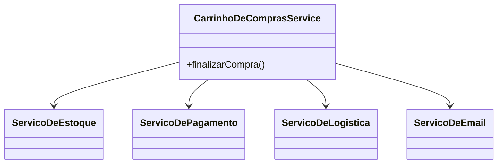
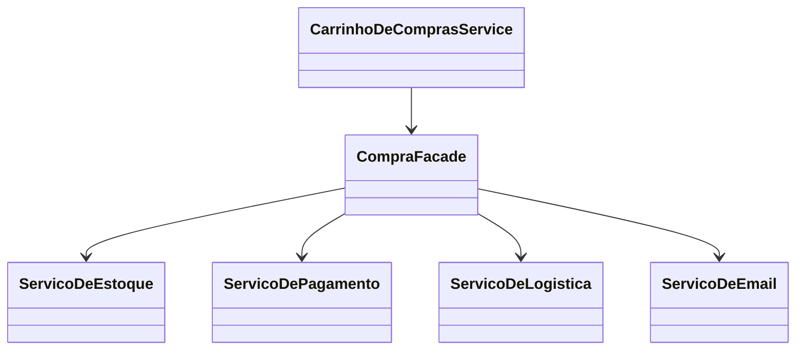

### **Aula (Parte 1/3) – Padrão de Projeto: Facade (Fachada)**

#### **🎯 Objetivo da Aula**
Compreender como o padrão **Facade** simplifica a interação com sistemas complexos, fornecendo uma interface única e coesa que esconde a complexidade interna.

---

#### **🤔 O Problema: A Orquestração Caótica de um E-commerce**

Imagine que estamos desenvolvendo o processo de finalização de compra de uma loja virtual. Quando um cliente clica em "Finalizar Pedido", várias operações complexas e interdependentes precisam acontecer em uma ordem específica:

1.  **Verificar o Estoque:** O `ServicoDeEstoque` precisa confirmar se todos os produtos do carrinho estão disponíveis.
2.  **Processar o Pagamento:** O `ServicoDePagamento` deve se comunicar com um gateway (ex: Stripe, PagSeguro) para autorizar o cartão de crédito.
3.  **Agendar a Entrega:** Se o pagamento for aprovado, o `ServicoDeLogistica` precisa criar um novo envio e agendar a coleta.
4.  **Enviar Notificação:** Por fim, o `ServicoDeEmail` deve enviar um e-mail de confirmação para o cliente.

**❌ A Solução sem um Padrão (Código Cliente Complexo):**

Sem um padrão, a classe que controla o carrinho de compras teria que conhecer e orquestrar todos esses serviços. O código ficaria assim:

```java
public class CarrinhoDeComprasService {
    // Dependências de todos os subsistemas
    private ServicoDeEstoque estoque = new ServicoDeEstoque();
    private ServicoDePagamento pagamento = new ServicoDePagamento();
    private ServicoDeLogistica logistica = new ServicoDeLogistica();
    private ServicoDeEmail email = new ServicoDeEmail();

    public boolean finalizarCompra(Carrinho carrinho, Cliente cliente) {
        System.out.println("Iniciando processo de finalização de compra...");
        
        // 1. Lógica complexa diretamente no cliente
        if (!estoque.verificar(carrinho)) {
            System.out.println("Erro: Produto fora de estoque.");
            return false;
        }
        
        if (!pagamento.processar(cliente, carrinho.getTotal())) {
            System.out.println("Erro: Pagamento recusado.");
            return false;
        }
        
        String codigoRastreio = logistica.agendarEntrega(carrinho, cliente.getEndereco());
        
        email.enviarConfirmacao(cliente.getEmail(), "Pedido Confirmado", "Seu pedido foi processado! Rastreio: " + codigoRastreio);
        
        System.out.println("Compra finalizada com sucesso!");
        return true;
    }
}
```

**❗ Problemas desta Abordagem:**
* **Alto Acoplamento:** A classe `CarrinhoDeComprasService` está fortemente acoplada a quatro subsistemas diferentes. Se um deles mudar, ela também precisa ser alterada.
* **Complexidade no Cliente:** A lógica de orquestração está toda no cliente. Se outro lugar do sistema precisar finalizar uma compra, essa lógica terá que ser duplicada.
* **Difícil Manutenção:** Alterar a ordem do fluxo (ex: agendar a entrega antes de cobrar) exige mexer em uma classe que já tem muitas responsabilidades.

**Diagrama do Problema:**


---

### **💡 A Solução: Criando uma Fachada para o Processo de Compra**

O padrão **Facade** propõe a criação de uma classe que atua como uma "fachada" ou ponto de entrada único para um subsistema complexo. Em vez de o cliente falar com todos, ele fala apenas com a fachada, e a fachada se encarrega de orquestrar o trabalho interno.

#### **🔧 Como Implementar o Facade**

1.  Criamos a classe `CompraFacade`.
2.  Dentro dela, centralizamos as instâncias de todos os subsistemas (`Estoque`, `Pagamento`, etc.).
3.  Criamos um método simples e de alto nível, como `public void finalizarCompra(...)`.
4.  Toda a lógica de orquestração que antes estava no cliente é movida para dentro deste método na `CompraFacade`.

**Código da Fachada:**
```java
// A Fachada que simplifica todo o processo de compra.
public class CompraFacade {
    // 1. A fachada conhece e encapsula os subsistemas.
    private ServicoDeEstoque estoque = new ServicoDeEstoque();
    private ServicoDePagamento pagamento = new ServicoDePagamento();
    private ServicoDeLogistica logistica = new ServicoDeLogistica();
    private ServicoDeEmail email = new ServicoDeEmail();

    // 2. O método da fachada é simples e direto.
    public void finalizarCompra(Carrinho carrinho, Cliente cliente) {
        System.out.println("Iniciando processo via Facade...");
        
        // 3. A complexidade da orquestração fica escondida aqui dentro.
        if (!estoque.verificar(carrinho)) {
            throw new RuntimeException("Erro: Produto fora de estoque.");
        }
        if (!pagamento.processar(cliente, carrinho.getTotal())) {
            throw new RuntimeException("Erro: Pagamento recusado.");
        }
        
        String codigoRastreio = logistica.agendarEntrega(carrinho, cliente.getEndereco());
        email.enviarConfirmacao(cliente.getEmail(), "Pedido Confirmado", "Seu pedido foi processado! Rastreio: " + codigoRastreio);
        
        System.out.println("Compra finalizada com sucesso via Facade!");
    }
}
```

#### **🔌 Usando a Fachada**
O nosso código cliente (`CarrinhoDeComprasService`) se torna trivial. Ele não precisa mais conhecer os detalhes do processo.

```java
// O cliente agora é muito mais simples!
public class CarrinhoDeComprasService {
    // A única dependência é a fachada.
    private CompraFacade compraFacade = new CompraFacade();

    public boolean finalizarCompra(Carrinho carrinho, Cliente cliente) {
        try {
            compraFacade.finalizarCompra(carrinho, cliente);
            return true;
        } catch (RuntimeException e) {
            System.err.println("Falha ao finalizar a compra: " + e.getMessage());
            return false;
        }
    }
}
```

**Diagrama da Solução:**

*Note que o `CarrinhoDeComprasService` não tem mais setas apontando para os subsistemas.*

---

### **✅ Vantagens e Desvantagens**

* **Vantagens:**
    * **Desacoplamento:** Isola o cliente da complexidade de um subsistema. Mudanças internas no subsistema não afetam o cliente, desde que a assinatura da fachada permaneça a mesma.
    * **Simplicidade:** Fornece uma interface muito mais simples de usar.
    * **Organização:** Ajuda a estruturar o sistema em camadas, onde cada fachada é um ponto de entrada para uma camada de serviços.

* **Desvantagens:**
    * A classe Facade pode se tornar um "God Object" (objeto que sabe e faz tudo), violando o Princípio da Responsabilidade Única, se não for bem gerenciada.
    * Não impede que um cliente mais "ousado" acesse diretamente as classes do subsistema, bypassando a fachada (o que pode ser bom ou ruim, dependendo do caso).

---

### **🤔 Quando Usar?**

* Quando você quer fornecer uma interface simples para um subsistema complexo.
* Para desacoplar as classes do seu sistema das dependências de um subsistema externo ou complicado.
* Quando você quer organizar seu sistema em camadas, e a fachada representa o ponto de entrada para cada camada.