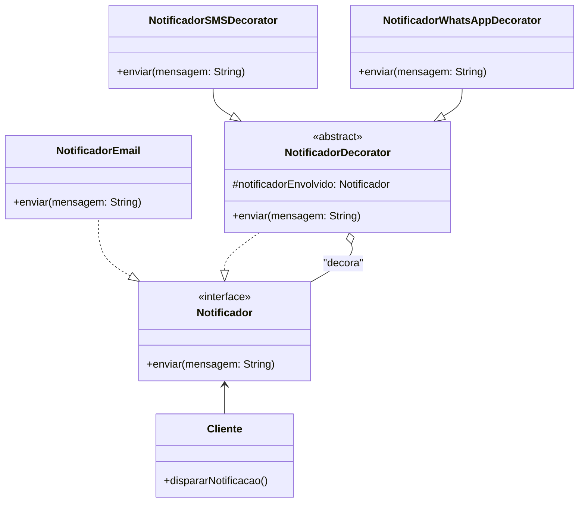

### **Aula (Parte 2/3) – Padrão de Projeto: Decorator**

#### **🎯 Objetivo da Aula**
Compreender como o padrão **Decorator** permite adicionar novas responsabilidades a objetos dinamicamente, "envolvendo-os" em novas classes, usando um sistema de notificação multicanal como exemplo.

---

#### **🤔 O Problema: Notificações em Múltiplos Canais**

Imagine um sistema que precisa notificar seus clientes sobre um evento importante, como a confirmação de um pedido. O requisito inicial é enviar a notificação por **e-mail**.

No entanto, o negócio evolui e agora precisa de mais flexibilidade. Para alguns clientes VIP, a notificação deve ser enviada por **E-mail e também por SMS**. Para outros, em campanhas específicas, por **E-mail, SMS e WhatsApp**.

**❌ A Solução com Herança ou Condicionais (Ruim):**

* **Herança:** Tentar resolver com herança levaria a uma **explosão de classes**: `NotificadorEmailSms`, `NotificadorEmailWhatsApp`, `NotificadorEmailSmsWhatsApp`, etc. Se adicionarmos um novo canal (ex: Telegram), o número de classes se multiplica. É uma abordagem rígida e insustentável.
* **Condicionais:** Ter uma única classe `Notificador` com `if`s para cada canal (`if (enviarSms) { ... }`) tornaria a classe massiva, difícil de manter e violaria o Princípio da Responsabilidade Única.

Como podemos adicionar canais de notificação de forma flexível e combinável, sem alterar as classes existentes?

---

### **💡 A Solução: Decorando o Notificador**

O padrão **Decorator** nos permite começar com um notificador base (E-mail) e "decorá-lo" com responsabilidades adicionais (SMS, WhatsApp) dinamicamente.

**A Estratégia:**
1.  Criamos uma interface `Notificador` com um método `enviar(String mensagem)`.
2.  Criamos uma classe `NotificadorEmail` que implementa essa interface. Este é o nosso objeto base.
3.  Criamos um "Decorador" abstrato que também implementa a interface `Notificador` e contém (envolve) uma referência a outro `Notificador`.
4.  Criamos decoradores concretos (`NotificadorSMSDecorator`, etc.). Quando seu método `enviar()` é chamado, ele primeiro chama o `enviar()` do objeto que ele envolve e, em seguida, executa sua própria lógica (enviar o SMS).

#### **🔧 Como Implementar o Decorator**

**Passo 1: Criar o Componente (A Interface Comum)**
Define a interface para o objeto que será decorado.

```java
// O Componente: a interface que todos os notificadores, base e decoradores, devem seguir.
public interface Notificador {
    void enviar(String mensagem);
}
```

**Passo 2: Criar o Componente Concreto (A Base)**
Esta é a nossa implementação principal e mais simples de notificação.

```java
// O Componente Concreto: a implementação base.
public class NotificadorEmail implements Notificador {
    @Override
    public void enviar(String mensagem) {
        System.out.println("Enviando notificação por E-mail: '" + mensagem + "'");
    }
}
```

**Passo 3: Criar o Decorador Abstrato**
Esta classe serve como base para todos os nossos decoradores. Ela implementa a mesma interface do componente e mantém a referência para o objeto que será decorado.

```java
// O Decorador Abstrato: segue a mesma interface e tem a referência para o objeto envolvido.
public abstract class NotificadorDecorator implements Notificador {
    protected Notificador notificadorEnvolvido;

    public NotificadorDecorator(Notificador notificador) {
        this.notificadorEnvolvido = notificador;
    }

    // O trabalho de enviar a notificação original é delegado ao objeto envolvido.
    @Override
    public void enviar(String mensagem) {
        notificadorEnvolvido.enviar(mensagem);
    }
}
```

**Passo 4: Criar os Decoradores Concretos**
Cada decorador adiciona sua própria funcionalidade *após* delegar a chamada.

```java
// Decorador Concreto para SMS
public class NotificadorSMSDecorator extends NotificadorDecorator {
    public NotificadorSMSDecorator(Notificador notificador) {
        super(notificador);
    }

    @Override
    public void enviar(String mensagem) {
        super.enviar(mensagem); // 1. Primeiro, executa o comportamento do objeto decorado (Email)
        System.out.println("Enviando notificação por SMS: '" + mensagem + "'"); // 2. Depois, adiciona sua própria funcionalidade
    }
}

// Decorador Concreto para WhatsApp
public class NotificadorWhatsAppDecorator extends NotificadorDecorator {
    public NotificadorWhatsAppDecorator(Notificador notificador) {
        super(notificador);
    }

    @Override
    public void enviar(String mensagem) {
        super.enviar(mensagem); // Chama o comportamento do objeto decorado (que pode ser Email ou Email+SMS)
        System.out.println("Enviando notificação por WhatsApp: '" + mensagem + "'"); // E adiciona a sua
    }
}
```

#### **📲 Montando o Notificador Multicanal**
O código cliente pode agora "montar" o notificador com os canais que desejar, de forma dinâmica.

```java
public class MainNotificacoes {
    public static void main(String[] args) {
        String mensagem = "Seu pedido #123 foi enviado!";

        System.out.println("--- Cenário 1: Notificação simples por E-mail ---");
        Notificador notificadorSimples = new NotificadorEmail();
        notificadorSimples.enviar(mensagem);

        System.out.println("\n--- Cenário 2: Notificação por E-mail e SMS ---");
        Notificador notificadorComSms = new NotificadorSMSDecorator(new NotificadorEmail());
        notificadorComSms.enviar(mensagem);
        
        System.out.println("\n--- Cenário 3: Notificação por E-mail, SMS e WhatsApp ---");
        // Começamos com a base e vamos "envolvendo" com os decoradores
        Notificador notificadorCompleto = new NotificadorEmail();
        notificadorCompleto = new NotificadorSMSDecorator(notificadorCompleto);
        notificadorCompleto = new NotificadorWhatsAppDecorator(notificadorCompleto);
        
        notificadorCompleto.enviar(mensagem);
    }
}
```
**Saída no console:**
```
--- Cenário 1: Notificação simples por E-mail ---
Enviando notificação por E-mail: 'Seu pedido #123 foi enviado!'

--- Cenário 2: Notificação por E-mail e SMS ---
Enviando notificação por E-mail: 'Seu pedido #123 foi enviado!'
Enviando notificação por SMS: 'Seu pedido #123 foi enviado!'

--- Cenário 3: Notificação por E-mail, SMS e WhatsApp ---
Enviando notificação por E-mail: 'Seu pedido #123 foi enviado!'
Enviando notificação por SMS: 'Seu pedido #123 foi enviado!'
Enviando notificação por WhatsApp: 'Seu pedido #123 foi enviado!'
```

---

### **📊 Diagrama de Classes da Solução**


---

### **✅ Vantagens e Desvantagens**

* **Vantagens:**
    * **Flexibilidade:** Permite adicionar ou remover responsabilidades em tempo de execução, simplesmente envolvendo ou não um objeto com um decorador.
    * **Princípio Aberto/Fechado:** Permite estender o comportamento de uma classe sem modificá-la.
    * **Evita a Explosão de Classes:** Previne a criação de um número massivo de subclasses para cada combinação de funcionalidades.

* **Desvantagens:**
    * **Muitos Objetos Pequenos:** Um design que usa Decorator intensivamente pode criar muitas classes pequenas e semelhantes, o que pode, a princípio, dificultar a compreensão do código.
    * **Complexidade na Instanciação:** A criação de um objeto decorado em várias camadas pode ser mais verbosa do que a simples instanciação de um objeto.