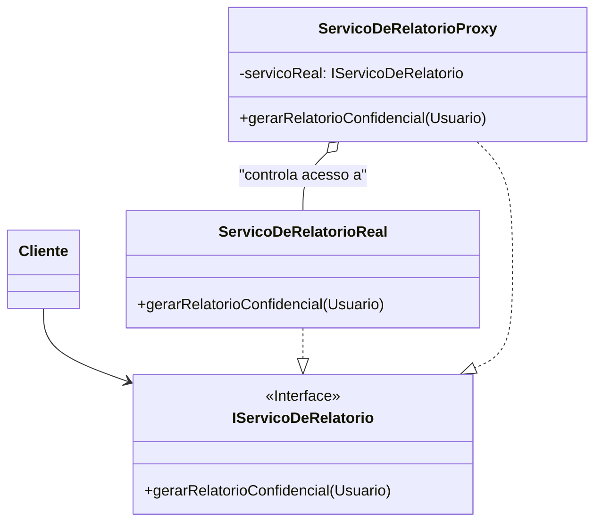

### **Aula (Parte 3/3) – Padrão de Projeto: Proxy**

#### **🎯 Objetivo da Aula**
Compreender como o padrão **Proxy** atua como um substituto ou placeholder para outro objeto, permitindo controlar o acesso a ele. Vamos focar em um exemplo de **Proxy de Proteção** para controle de acesso de usuários.

---

#### **🤔 O Problema: Quem Pode Acessar o quê?**

Imagine um sistema que gera relatórios. Temos um serviço que se conecta ao banco de dados e monta um relatório financeiro, uma operação sensível e custosa.

```java
// O objeto real que faz o trabalho pesado e acessa dados sensíveis.
public class ServicoDeRelatorio {
    public void gerarRelatorioConfidencial() {
        System.out.println("Conectando ao banco de dados...");
        System.out.println("Coletando dados financeiros sigilosos...");
        System.out.println("Gerando relatório confidencial em PDF...");
        System.out.println("Relatório gerado com sucesso!");
    }
}
```

O requisito de negócio é claro: **apenas usuários com perfil de "ADMIN" podem gerar este relatório**.

**❌ A Solução sem um Padrão (Lógica Misturada):**

A primeira ideia seria colocar a verificação de permissão dentro do próprio `ServicoDeRelatorio`:

```java
public class ServicoDeRelatorio {
    public void gerarRelatorioConfidencial(Usuario usuario) {
        // 1. Verificação de segurança misturada com a lógica de negócio.
        if (!"ADMIN".equals(usuario.getPerfil())) {
            throw new SecurityException("Acesso negado! Permissão insuficiente.");
        }
        
        System.out.println("Gerando relatório confidencial...");
        // ...lógica para gerar o relatório...
    }
}
```

**❗ Problemas desta Abordagem:**
* **Violação do Princípio da Responsabilidade Única (SRP):** A classe `ServicoDeRelatorio` agora tem duas responsabilidades: gerar relatórios E controlar o acesso. A lógica de negócio está misturada com a lógica de segurança.
* **Dificuldade de Manutenção e Teste:** Se as regras de permissão mudarem, teremos que alterar uma classe central do sistema. Testar a geração do relatório de forma isolada, sem a camada de segurança, fica mais difícil.

---

### **💡 A Solução: Um Proxy para Proteger o Serviço Real**

O padrão **Proxy** nos permite criar um objeto "representante" que fica na frente do objeto real. O cliente interage com o Proxy, que tem exatamente a mesma interface do objeto real. O Proxy então decide se deve ou não repassar a chamada para o objeto real.

#### **🔧 Como Implementar o Proxy de Proteção**

1.  **Criar uma interface comum:** Tanto o objeto real quanto o proxy implementarão a mesma interface. Isso torna o proxy transparente para o cliente.
2.  **Implementar o Objeto Real:** A classe de serviço real (`ServicoDeRelatorioReal`) implementa a interface e foca exclusivamente em sua responsabilidade principal (gerar o relatório).
3.  **Implementar o Proxy:** A classe `ServicoDeRelatorioProxy` também implementa a interface. Ela contém uma referência ao objeto real e, antes de delegar a chamada, executa a lógica de verificação de acesso.

**Passo 1: A Interface Comum (O Assunto)**
```java
// O Assunto (Subject): define a interface comum para o Objeto Real e o Proxy.
public interface IServicoDeRelatorio {
    void gerarRelatorioConfidencial(Usuario usuario);
}
```

**Passo 2: O Objeto Real (Real Subject)**
```java
// O Objeto Real: focado apenas na sua tarefa principal.
public class ServicoDeRelatorioReal implements IServicoDeRelatorio {
    @Override
    public void gerarRelatorioConfidencial(Usuario usuario) {
        System.out.println(">> (Objeto Real) Gerando relatório confidencial para o usuário: " + usuario.getNome());
    }
}
```

**Passo 3: O Proxy (Proxy)**
```java
// O Proxy: controla o acesso ao Objeto Real.
public class ServicoDeRelatorioProxy implements IServicoDeRelatorio {
    private IServicoDeRelatorio servicoReal;

    public ServicoDeRelatorioProxy() {
        // A instância do objeto real pode ser criada aqui ou recebida.
        this.servicoReal = new ServicoDeRelatorioReal();
    }

    @Override
    public void gerarRelatorioConfidencial(Usuario usuario) {
        System.out.println(">> (Proxy) Recebendo a solicitação...");
        
        // 1. Lógica de controle de acesso.
        if (temPermissao(usuario)) {
            System.out.println(">> (Proxy) Usuário autorizado. Delegando para o serviço real.");
            // 2. Se autorizado, delega a chamada para o objeto real.
            servicoReal.gerarRelatorioConfidencial(usuario);
        } else {
            // 3. Se não, bloqueia o acesso.
            throw new SecurityException("Acesso negado! O usuário '" + usuario.getNome() + "' não tem perfil de ADMIN.");
        }
    }

    private boolean temPermissao(Usuario usuario) {
        return "ADMIN".equals(usuario.getPerfil());
    }
}
```

#### **🛡️ Usando o Proxy**
O código cliente agora interage com o Proxy, sem precisar saber da complexidade da verificação.

```java
public class MainSeguranca {
    public static void main(String[] args) {
        Usuario admin = new Usuario("Alice", "ADMIN");
        Usuario comum = new Usuario("Bob", "USUARIO");

        // O cliente pensa que está usando o serviço real, mas está usando o proxy.
        IServicoDeRelatorio servico = new ServicoDeRelatorioProxy();

        System.out.println("--- Tentativa de acesso com usuário ADMIN ---");
        try {
            servico.gerarRelatorioConfidencial(admin);
        } catch (SecurityException e) {
            System.err.println(e.getMessage());
        }

        System.out.println("\n--- Tentativa de acesso com usuário COMUM ---");
        try {
            servico.gerarRelatorioConfidencial(comum);
        } catch (SecurityException e) {
            System.err.println(e.getMessage());
        }
    }
}
```
**Saída no console:**
```
--- Tentativa de acesso com usuário ADMIN ---
>> (Proxy) Recebendo a solicitação...
>> (Proxy) Usuário autorizado. Delegando para o serviço real.
>> (Objeto Real) Gerando relatório confidencial para o usuário: Alice

--- Tentativa de acesso com usuário COMUM ---
>> (Proxy) Recebendo a solicitação...
Exception in thread "main" java.lang.SecurityException: Acesso negado! O usuário 'Bob' não tem perfil de ADMIN.
```

---

### **📊 Diagrama de Classes da Solução**


---

### **Proxy vs. Decorator: Qual a Diferença?**
* **Intenção:** A intenção do **Decorator** é **adicionar responsabilidades** a um objeto. A do **Proxy** é **controlar o acesso** a ele.
* **Implementação:** Decorators permitem o empilhamento recursivo (um café com leite e chocolate). Proxies geralmente gerenciam seu objeto real de forma mais direta e não são feitos para serem empilhados.

### **Tipos Comuns de Proxy**
* **Proxy de Proteção:** O que vimos. Controla o acesso.
* **Proxy Virtual:** Cria objetos "pesados" apenas quando são realmente necessários (lazy initialization).
* **Proxy Remoto:** Representa um objeto que está em outro espaço de endereçamento (ex: em outro servidor na rede).

### **✅ Vantagens e Desvantagens**

* **Vantagens:**
    * Permite executar tarefas antes ou depois da chamada ao objeto real sem que o cliente saiba.
    * Permite controlar o ciclo de vida do objeto real (ex: criá-lo só quando necessário).
    * Mantém a lógica de negócio do objeto real limpa e focada.

* **Desvantagens:**
    * Adiciona uma camada de indireção que pode complicar um pouco o código.
    * A resposta do proxy pode ser mais lenta se ele precisar realizar operações complexas (como inicializar o objeto real pela primeira vez).