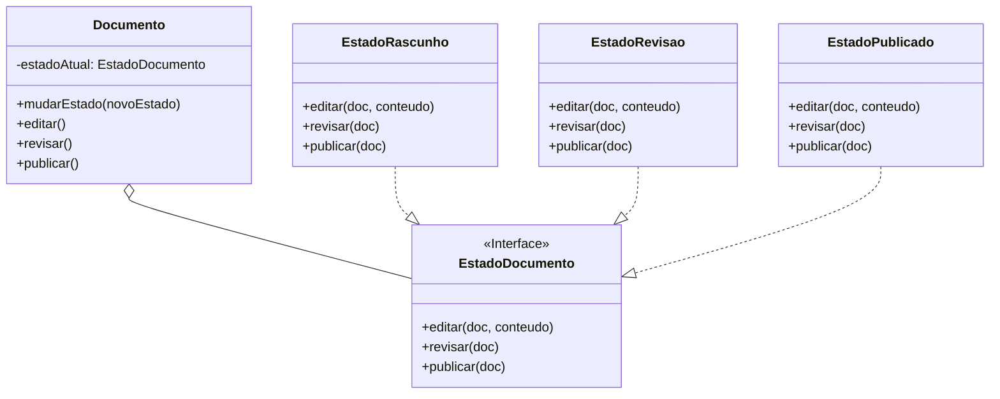

### **Aula – Padrão de Projeto: State (Estado)**

#### **🎯 Objetivo da Aula**

Compreender como o padrão **State** permite que um objeto altere seu comportamento quando seu estado interno muda, fazendo parecer que o objeto mudou de classe.

-----

#### **🤔 O Problema: O Caos dos `if/else` em um Objeto com Múltiplos Estados**

Imagine que estamos modelando um `Documento` em um sistema de gerenciamento de conteúdo. Um documento pode passar por vários estágios:

1.  **Rascunho (Draft):** Pode ser editado livremente.
2.  **Em Revisão (In Review):** Não pode mais ser editado, aguardando aprovação.
3.  **Publicado (Published):** Não pode ser editado e fica visível para todos.

As ações que podemos tomar (`editar`, `publicar`) dependem **totalmente** do estado atual do documento.

**❌ A Solução sem um Padrão (Complexa e Difícil de Manter):**

A abordagem mais comum (e problemática) é usar uma variável para controlar o estado (ex: `private String estado = "RASCUNHO";`) e encher os métodos com `if/else` ou `switch`:

```java
public class Documento {
    private String estado;
    private String conteudo;

    public Documento() {
        this.estado = "RASCUNHO";
    }

    public void editar(String novoConteudo) {
        if ("RASCUNHO".equals(estado)) {
            this.conteudo = novoConteudo;
            System.out.println("Documento editado.");
        } else {
            System.out.println("Erro: Documento não pode ser editado no estado '" + estado + "'.");
        }
    }

    public void publicar() {
        if ("RASCUNHO".equals(estado)) {
            System.out.println("Erro: Documento precisa ser revisado antes de publicar.");
        } else if ("EM_REVISAO".equals(estado)) {
            this.estado = "PUBLICADO";
            System.out.println("Documento publicado com sucesso!");
        } else if ("PUBLICADO".equals(estado)) {
            System.out.println("Aviso: Documento já está publicado.");
        }
    }
    // ... outros métodos com a mesma lógica de condicionais ...
}
```

**❗ Problemas desta Abordagem:**

* **Código Massivo e Acoplado:** Cada método contém a lógica de todos os estados possíveis. Adicionar um novo estado (ex: "Arquivado") exige alterar todos os métodos da classe.
* **Violação do Princípio Aberto/Fechado:** A classe não está fechada para modificação.
* **Lógica Duplicada:** A mesma verificação de estado (`if (estado == ...)` se espalha por vários métodos.

-----

### **💡 A Solução: Encapsulando o Estado em Classes**

O padrão **State** sugere uma abordagem radicalmente diferente: em vez de usar uma variável e `if`s, vamos **encapsular todo o comportamento associado a um estado em sua própria classe**.

O objeto principal (o `Documento`, que chamamos de **Contexto**) não terá mais a lógica de estado. Ele apenas manterá uma referência para um objeto de "Estado" atual e delegará todas as chamotecas a ele.

#### **🔧 Como Implementar o State**

1.  **Criar a Interface de Estado:** `EstadoDocumento`, que define todos os métodos que o Contexto pode chamar (`editar`, `publicar`, etc.).
2.  **Criar Classes de Estado Concretas:** Para cada estado possível, criamos uma classe que implementa a interface `EstadoDocumento` (ex: `EstadoRascunho`, `EstadoRevisao`). A lógica de cada ação para aquele estado específico viverá dentro dessas classes.
3.  **Modificar o Contexto:** A classe `Documento` agora terá um atributo `private EstadoDocumento estadoAtual`. Seus métodos (`editar()`, `publicar()`) simplesmente chamarão o método correspondente no objeto `estadoAtual`.

**Passo 1: A Interface de Estado (State)**

```java
// A interface State: declara os métodos que todos os estados concretos devem implementar.
public interface EstadoDocumento {
    void editar(Documento doc, String conteudo);
    void revisar(Documento doc);
    void publicar(Documento doc);
}
```

*(Note que os métodos recebem o próprio `Documento` como parâmetro para poderem alterar seu estado).*

**Passo 2: As Classes de Estado Concretas**

```java
// Um Estado Concreto: implementa o comportamento associado a um estado do Contexto.
public class EstadoRascunho implements EstadoDocumento {
    @Override
    public void editar(Documento doc, String conteudo) {
        doc.setConteudo(conteudo);
        System.out.println("Conteúdo do rascunho atualizado.");
    }

    @Override
    public void revisar(Documento doc) {
        System.out.println("Enviando para revisão...");
        doc.mudarEstado(new EstadoRevisao()); // Transição para o próximo estado!
    }

    @Override
    public void publicar(Documento doc) {
        System.out.println("Ação inválida: Um rascunho não pode ser publicado diretamente.");
    }
}

public class EstadoRevisao implements EstadoDocumento {
    @Override
    public void editar(Documento doc, String conteudo) {
        System.out.println("Ação inválida: Não é possível editar um documento em revisão.");
    }

    @Override
    public void revisar(Documento doc) {
        System.out.println("Aviso: O documento já está em revisão.");
    }
    
    @Override
    public void publicar(Documento doc) {
        System.out.println("Publicando o documento...");
        doc.mudarEstado(new EstadoPublicado()); // Transição para o próximo estado!
    }
}
// A classe EstadoPublicado seria implementada de forma similar.
```

**Passo 3: O Contexto**
A classe `Documento` se torna muito mais simples.

```java
public class Documento {
    private EstadoDocumento estadoAtual;
    private String conteudo;

    public Documento() {
        // O estado inicial é definido aqui
        this.estadoAtual = new EstadoRascunho();
    }

    // O contexto permite que os objetos de estado mudem o seu estado.
    public void mudarEstado(EstadoDocumento novoEstado) {
        this.estadoAtual = novoEstado;
    }

    public void setConteudo(String conteudo) { this.conteudo = conteudo; }

    // O contexto delega o comportamento para o objeto de estado atual.
    public void editar(String novoConteudo) {
        estadoAtual.editar(this, novoConteudo);
    }

    public void revisar() {
        estadoAtual.revisar(this);
    }

    public void publicar() {
        estadoAtual.publicar(this);
    }
}
```

-----

### **📊 Diagrama de Classes da Solução**



-----

### **State vs. Strategy: Qual a Diferença?**

* **State:** As mudanças de estado são geralmente internas e automáticas, acontecendo como consequência de uma ação (`revisar()` muda o estado para `EstadoRevisao`). O objeto **gerencia seu próprio estado**.
* **Strategy:** A mudança de algoritmo é controlada pelo **cliente externo**. O cliente decide qual "estratégia" (algoritmo) usar em um determinado momento.

### **✅ Vantagens e Desvantagens**

* **Vantagens:**

    * **Princípio da Responsabilidade Única:** Isola a lógica de cada estado em sua própria classe.
    * **Princípio Aberto/Fechado:** Adicionar um novo estado se resume a criar uma nova classe, sem alterar as existentes.
    * **Elimina Condicionais:** O código do contexto fica limpo e livre de `if/else` ou `switch`.

* **Desvantagens:**

    * **Aumento do número de classes:** Se um objeto tiver muitos estados, isso pode levar a um grande número de classes pequenas no sistema.

### **🤔 Quando Usar?**

* Quando você tem um objeto cujo comportamento depende de seu estado, e ele deve mudar seu comportamento em tempo de execução.
* Quando a lógica de negócio de um objeto é dominada por condicionais complexas baseadas no estado.
* **Exemplos:** Máquinas de venda automática, status de um pedido em um e-commerce, estado de uma conexão de rede, estados de um jogador em um jogo (andando, correndo, pulando).