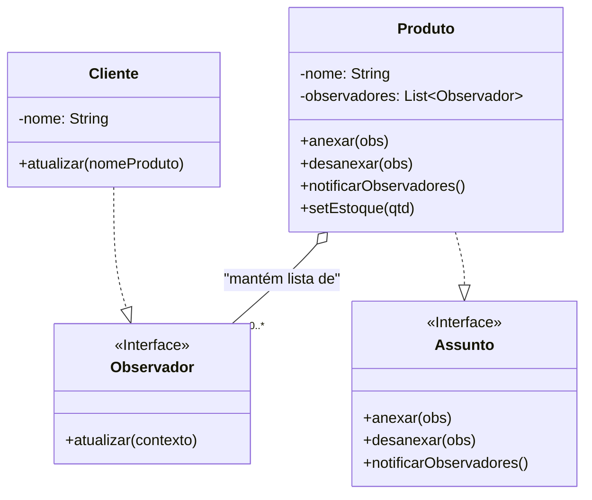

### **Aula – Padrão de Projeto: Observer (Observador)**

#### **🎯 Objetivo da Aula**

Compreender como o padrão **Observer** define um mecanismo de assinatura para notificar múltiplos objetos sobre quaisquer eventos que aconteçam ao objeto que eles estão observando, promovendo um baixo acoplamento.

-----

#### **🤔 O Problema: Notificando Interessados sobre a Volta de um Produto ao Estoque**

Imagine um sistema de e-commerce onde um produto muito popular, como um "PlayStation 5", fica frequentemente sem estoque. Vários clientes gostariam de ser avisados assim que o produto estivesse disponível novamente para compra.

Como o objeto `Produto` pode notificar todos os `Clientes` interessados quando seu estoque for reabastecido?

**❌ A Solução sem um Padrão (Fortemente Acoplada):**

Uma abordagem ingênua seria fazer a classe `Produto` ter uma lista de `Cliente`s. Quando o estoque mudasse, o `Produto` teria que percorrer essa lista e chamar um método específico em cada `Cliente`.

```java
// Abordagem ruim
public class Produto {
    private List<Cliente> clientesInteressados = new ArrayList<>();
    private int estoque;

    public void setEstoque(int novoEstoque) {
        // Se o produto voltou ao estoque...
        if (this.estoque == 0 && novoEstoque > 0) {
            // ... notifica todos os clientes da lista.
            for (Cliente cliente : clientesInteressados) {
                cliente.produtoDisponivel(this.nome); // O Produto PRECISA conhecer o método do Cliente.
            }
        }
        this.estoque = novoEstoque;
    }
}
```

**❗ Problemas desta Abordagem:**

* **Alto Acoplamento:** A classe `Produto` está fortemente acoplada à classe `Cliente`. O `Produto` precisa saber detalhes sobre a implementação do `Cliente` (como o nome do método `produtoDisponivel`).
* **Violação do Princípio Aberto/Fechado:** E se, além dos clientes, o `SistemaDeMarketing` também quisesse ser notificado para criar uma campanha? Teríamos que alterar a classe `Produto` para adicionar uma lista de `SistemaDeMarketing` e uma nova lógica de notificação. A classe `Produto` não está fechada para modificação.

-----

### **💡 A Solução: Um Mecanismo de Assinatura (Observer)**

O padrão **Observer** resolve isso criando um sistema de "assinatura".

* O objeto que está sendo observado é chamado de **Subject** (Assunto).
* Os objetos que observam são chamados de **Observers** (Observadores).

O Subject não conhece os detalhes dos seus Observers. Ele apenas sabe que eles podem ser notificados. Qualquer objeto que queira ser notificado simplesmente "assina" o Subject.

#### **🔧 Como Implementar o Observer**

1.  **Criar a Interface `Observador`:** Define o método que o Subject chamará para notificar, geralmente `atualizar()`.
2.  **Criar a Interface `Assunto` (Subject):** Define os métodos para gerenciar os assinantes: `anexar(observador)`, `desanexar(observador)` e `notificarObservadores()`.
3.  **Implementar o `AssuntoConcreto`:** Nossa classe `Produto` implementará a interface `Assunto`. Ela manterá uma lista de `Observador`es. Quando seu estado mudar (o estoque for reabastecido), ela chamará seu próprio método `notificarObservadores()`.
4.  **Implementar o `ObservadorConcreto`:** Nossa classe `Cliente` implementará a interface `Observador`. O método `atualizar()` conterá a lógica do que fazer ao ser notificado.

**Passo 1 e 2: As Interfaces**

```java
// A interface que todos os observadores devem implementar
public interface Observador {
    void atualizar(String nomeProduto);
}

// A interface que o assunto (quem é observado) deve implementar
public interface Assunto {
    void anexar(Observador observador);
    void desanexar(Observador observador);
    void notificarObservadores();
}
```

**Passo 3: O Assunto Concreto**

```java
import java.util.ArrayList;
import java.util.List;

// O Assunto Concreto
public class Produto implements Assunto {
    private String nome;
    private int estoque;
    private List<Observador> observadores = new ArrayList<>();

    public Produto(String nome) {
        this.nome = nome;
    }

    public void setEstoque(int novoEstoque) {
        // Se o produto estava sem estoque e agora tem, notifique!
        if (this.estoque == 0 && novoEstoque > 0) {
            System.out.println("O produto '" + this.nome + "' voltou ao estoque!");
            notificarObservadores(); // Chama a notificação
        }
        this.estoque = novoEstoque;
    }

    @Override
    public void anexar(Observador observador) {
        observadores.add(observador);
    }

    @Override
    public void desanexar(Observador observador) {
        observadores.remove(observador);
    }

    @Override
    public void notificarObservadores() {
        // O Subject não sabe quem são os observadores, apenas os notifica.
        for (Observador obs : observadores) {
            obs.atualizar(this.nome);
        }
    }
}
```

**Passo 4: O Observador Concreto**

```java
// O Observador Concreto
public class Cliente implements Observador {
    private String nome;

    public Cliente(String nome) {
        this.nome = nome;
    }

    @Override
    public void atualizar(String nomeProduto) {
        System.out.println("  >> Notificação para " + this.nome + ": O produto '" + nomeProduto + "' está disponível novamente!");
    }
}
```

#### **📢 Usando o Sistema de Notificação**

O código cliente agora pode registrar dinamicamente qualquer objeto que seja um `Observador` para ser notificado pelo `Produto`.

```java
public class MainLoja {
    public static void main(String[] args) {
        // 1. Criar o Assunto (o produto que será observado)
        Produto ps5 = new Produto("PlayStation 5");

        // 2. Criar os Observadores (os clientes interessados)
        Cliente cliente1 = new Cliente("João");
        Cliente cliente2 = new Cliente("Maria");

        // 3. Registrar os observadores no assunto
        ps5.anexar(cliente1);
        ps5.anexar(cliente2);

        System.out.println("Situação inicial: Estoque zerado.");
        ps5.setEstoque(0);

        System.out.println("\n...algum tempo depois...");

        // 4. Mudar o estado do Assunto. Isso deve disparar a notificação.
        ps5.setEstoque(10);
    }
}
```

**Saída no console:**

```
Situação inicial: Estoque zerado.

...algum tempo depois...
O produto 'PlayStation 5' voltou ao estoque!
  >> Notificação para João: O produto 'PlayStation 5' está disponível novamente!
  >> Notificação para Maria: O produto 'PlayStation 5' está disponível novamente!
```

-----

### **📊 Diagrama de Classes da Solução**



-----

### **✅ Vantagens e Desvantagens**

* **Vantagens:**

    * **Baixo Acoplamento:** O Subject conhece apenas a interface `Observador`, não as classes concretas. Os Observers podem ser adicionados e removidos a qualquer momento.
    * **Princípio Aberto/Fechado:** Você pode introduzir novos tipos de observadores (ex: `SistemaDeMarketing`, `AppGerencial`) sem alterar o código do Subject.
    * **Reutilização:** Como o Subject e os Observers são pouco acoplados, eles podem ser reutilizados em outras aplicações de forma independente.

* **Desvantagens:**

    * **Ordem de Notificação:** A ordem em que os observadores são notificados não é garantida.
    * **Atualizações Inesperadas:** Se não for bem gerenciado, um observador pode disparar uma atualização em outro, que dispara outra, levando a cascatas de atualizações complexas e difíceis de depurar.

### **🤔 Quando Usar?**

* Quando uma mudança no estado de um objeto precisa ser refletida em outros objetos, sem que eles estejam fortemente acoplados.
* Quando o número de objetos que precisam ser notificados é dinâmico ou desconhecido.
* **Exemplos práticos:** Interfaces gráficas (o modelo de dados é o Subject, os componentes visuais são Observers), sistemas de eventos, feeds de redes sociais, e qualquer implementação do padrão MVC (Model-View-Controller), onde a View (Observer) observa o Model (Subject).