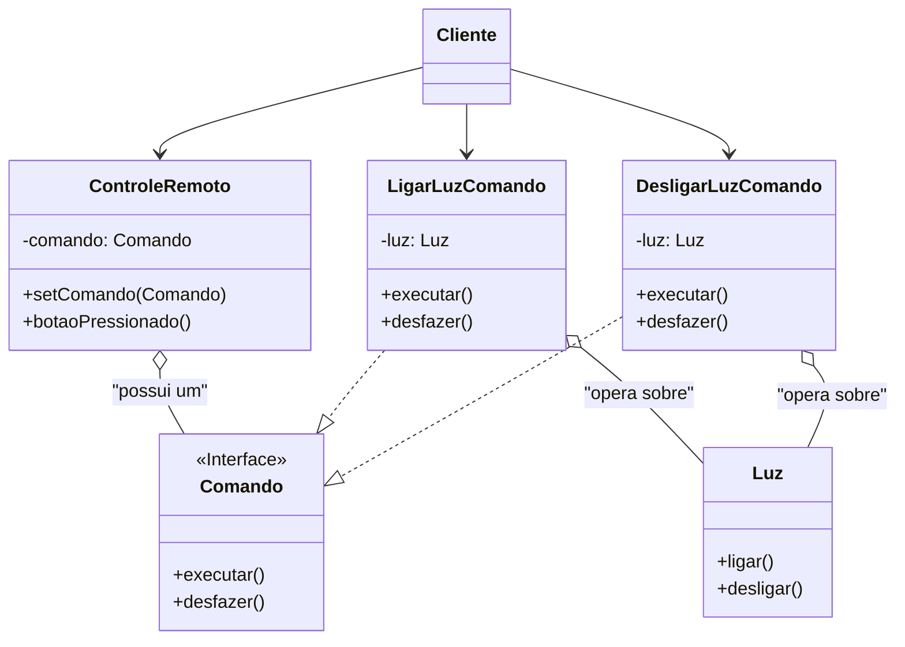

### **Aula – Padrão de Projeto: Command (Comando)**

#### **🎯 Objetivo da Aula**

Compreender como o padrão **Command** encapsula uma solicitação como um objeto, permitindo parametrizar clientes com diferentes solicitações, enfileirar ou registrar solicitações e suportar operações que podem ser desfeitas.

-----

#### **🤔 O Problema: Acoplando o "O Quê" ao "Como"**

Imagine que estamos desenvolvendo um controle remoto para uma casa inteligente. Este controle tem vários botões, e cada um pode executar uma ação diferente em um dispositivo diferente:

* Um botão para **ligar a luz** da sala.
* Outro para **desligar a luz**.
* Um terceiro para **aumentar o volume** da smart speaker.

**❌ A Solução sem um Padrão (Fortemente Acoplada):**

A abordagem mais direta seria codificar a ação diretamente no botão. Cada botão teria uma referência direta ao objeto que ele controla e chamaria seu método específico.

```java
public class ControleRemoto {
    private Luz luzDaSala = new Luz();
    private SmartSpeaker somDaSala = new SmartSpeaker();

    public void botaoLigarLuzPressionado() {
        luzDaSala.ligar(); // O controle ESTÁ ACOPLADO à classe Luz.
    }

    public void botaoAumentarVolumePressionado() {
        somDaSala.aumentarVolume(); // E também à classe SmartSpeaker.
    }
    // ... um método para cada botão ...
}
```

**❗ Problemas desta Abordagem:**

* **Alto Acoplamento:** A classe `ControleRemoto` está firmemente acoplada a todas as classes de dispositivos (`Luz`, `SmartSpeaker`, etc.).
* **Violação do Princípio Aberto/Fechado:** Se quisermos adicionar um novo dispositivo (ex: `ArCondicionado`), temos que **alterar** a classe `ControleRemoto`, adicionando novas dependências e métodos.
* **Impossível Implementar Desfazer (Undo):** Como poderíamos implementar um botão "Desfazer Última Ação"? Teríamos que manter um histórico complexo de qual método foi chamado, com quais parâmetros, o que é quase impraticável.
* **Nenhuma Flexibilidade:** Não podemos reconfigurar os botões em tempo de execução.

-----

### **💡 A Solução: A Solicitação como um Objeto**

O padrão **Command** resolve isso tratando a **solicitação em si como um objeto**. Em vez de o controle remoto chamar `luz.ligar()` diretamente, ele apenas executará um "objeto de comando" genérico, sem saber o que ele faz.

#### **🔧 Como Implementar o Command**

1.  **Criar a Interface `Comando`:** Define um único método, geralmente `executar()`.
2.  **Criar os Comandos Concretos:** Para cada ação, criamos uma classe que implementa `Comando` (ex: `LigarLuzComando`). Essa classe contém uma referência ao objeto que fará o trabalho (o **Receiver**) e, no seu método `executar()`, ela chama o método apropriado do Receiver.
3.  **Definir os Receivers:** As classes que fazem o trabalho real (`Luz`, `SmartSpeaker`). Elas não sabem nada sobre os comandos.
4.  **Criar o Invoker:** A classe que dispara a ação (`ControleRemoto`). Ela não conhece o Receiver, apenas possui uma referência a um objeto `Comando` e chama seu método `executar()`.

**Passo 1: A Interface de Comando (Command)**

```java
// A interface Command
public interface Comando {
    void executar();
    void desfazer(); // Adicionando suporte para Undo!
}
```

**Passo 2: Os Objetos de Ação (Receivers)**

```java
// O Receiver
public class Luz {
    public void ligar() { System.out.println("Luz está acesa."); }
    public void desligar() { System.out.println("Luz está apagada."); }
}
```

**Passo 3: Os Comandos Concretos**

```java
// Um Comando Concreto
public class LigarLuzComando implements Comando {
    private Luz luz; // Referência para o Receiver

    public LigarLuzComando(Luz luz) {
        this.luz = luz;
    }

    @Override
    public void executar() {
        luz.ligar();
    }
    
    @Override
    public void desfazer() {
        luz.desligar(); // A ação de desfazer "ligar" é "desligar"
    }
}

public class DesligarLuzComando implements Comando {
    private Luz luz;

    public DesligarLuzComando(Luz luz) {
        this.luz = luz;
    }

    @Override
    public void executar() {
        luz.desligar();
    }
    
    @Override
    public void desfazer() {
        luz.ligar();
    }
}
```

**Passo 4: O Disparador da Ação (Invoker)**

```java
// O Invoker
public class ControleRemoto {
    private Comando comando;
    private Comando ultimoComandoExecutado;

    public void setComando(Comando comando) {
        this.comando = comando;
    }

    public void botaoPressionado() {
        if (comando != null) {
            comando.executar();
            ultimoComandoExecutado = comando;
        }
    }
    
    public void botaoDesfazerPressionado() {
        if (ultimoComandoExecutado != null) {
            System.out.print("Desfazendo última ação... ");
            ultimoComandoExecutado.desfazer();
            ultimoComandoExecutado = null;
        }
    }
}
```

#### **🕹️ Usando o Sistema**

O cliente agora é responsável por criar os comandos e associá-los ao invoker.

```java
public class MainCasaInteligente {
    public static void main(String[] args) {
        // 1. Criar os receivers
        Luz luzDaCozinha = new Luz();

        // 2. Criar os comandos, associando-os aos receivers
        Comando ligarLuz = new LigarLuzComando(luzDaCozinha);
        Comando desligarLuz = new DesligarLuzComando(luzDaCozinha);

        // 3. Criar o invoker
        ControleRemoto controle = new ControleRemoto();

        // 4. Configurar e usar o invoker
        controle.setComando(ligarLuz);
        controle.botaoPressionado(); // Saída: Luz está acesa.

        controle.setComando(desligarLuz);
        controle.botaoPressionado(); // Saída: Luz está apagada.
        
        // 5. Demonstrando o Desfazer
        System.out.println("\n--- Testando o Undo ---");
        controle.setComando(ligarLuz);
        controle.botaoPressionado();      // Liga a luz
        controle.botaoDesfazerPressionado(); // Desfaz, desligando a luz
    }
}
```

-----

### **📊 Diagrama de Classes da Solução**



-----

### **✅ Vantagens e Desvantagens**

* **Vantagens:**

    * **Desacoplamento:** Desacopla quem invoca a ação de quem a executa. O `ControleRemoto` não sabe nada sobre a `Luz`.
    * **Princípio da Responsabilidade Única:** Cada classe tem uma única e clara responsabilidade.
    * **Extensibilidade:** Adicionar novos comandos é fácil, basta criar novas classes que implementam a interface `Comando`, sem tocar no código do `Invoker`.
    * **Suporte a Funcionalidades Avançadas:** Facilita a implementação de filas de comandos, logs de operações e, principalmente, operações de desfazer/refazer.

* **Desvantagens:**

    * **Aumento do número de classes:** Pode levar a uma proliferação de classes pequenas para cada ação no sistema, aumentando a complexidade geral.

### **🤔 Quando Usar?**

* Quando você quer parametrizar objetos com ações (ex: configurar um botão de uma UI).
* Quando você quer colocar ações em uma fila, executá-las remotamente ou registrar (logar) as operações.
* Quando você precisa de uma funcionalidade de "desfazer". O padrão Command é a forma clássica de implementar isso.