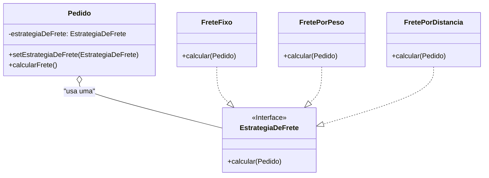

### **Aula – Padrão de Projeto: Strategy (Estratégia)**

#### **🎯 Objetivo da Aula**

Compreender como o padrão **Strategy** permite definir uma família de algoritmos, encapsular cada um deles e torná-los intercambiáveis, permitindo que o algoritmo varie independentemente dos clientes que o utilizam.

-----

#### **🤔 O Problema: Múltiplas Formas de Calcular o Frete**

Imagine o sistema de e-commerce do nosso projeto. Um dos requisitos é calcular o valor do frete de um pedido. No entanto, a empresa oferece várias formas de cálculo, e novas formas podem ser adicionadas no futuro:

1.  **Frete Fixo:** Um valor fixo para qualquer entrega (ex: R$ 10,00).
2.  **Frete por Peso:** O valor é calculado com base no peso total dos produtos (ex: R$ 5,00 por quilo).
3.  **Frete por Distância:** O valor é baseado na distância em quilômetros até o endereço do cliente (ex: R$ 1,50 por km).

**❌ A Solução sem um Padrão (Rígida e Difícil de Manter):**

A abordagem mais comum seria colocar toda a lógica de cálculo dentro de um único método na classe `Pedido`, usando `if/else` ou `switch` para selecionar o algoritmo correto.

```java
public class Pedido {
    private String tipoFrete;
    private double pesoTotal;
    private double distancia;

    public double calcularFrete() {
        if ("FIXO".equals(tipoFrete)) {
            return 10.00;
        } else if ("PESO".equals(tipoFrete)) {
            return this.pesoTotal * 5.0;
        } else if ("DISTANCIA".equals(tipoFrete)) {
            return this.distancia * 1.5;
        } else {
            return 0.0; // ou lançar uma exceção
        }
    }
    // ... outros métodos da classe ...
}
```

**❗ Problemas desta Abordagem:**

* **Violação do Princípio Aberto/Fechado:** Se a empresa decidir adicionar uma nova forma de frete (ex: "Frete Expresso Sedex"), teremos que **alterar** a classe `Pedido`, adicionando mais um `else if`. A classe não está fechada para modificação.
* **Violação da Responsabilidade Única:** A classe `Pedido` agora tem duas responsabilidades: gerenciar os dados do pedido E conhecer todos os detalhes de todos os algoritmos de frete possíveis.
* **Código Confuso:** Com o tempo, essa cadeia de `if/else` tende a crescer e se tornar um ponto de manutenção complexo e propenso a erros.

-----

### **💡 A Solução: Encapsulando os Algoritmos em Estratégias**

O padrão **Strategy** resolve este problema extraindo os algoritmos para classes separadas, chamadas de "Estratégias". Cada classe de estratégia implementará uma interface comum. O objeto principal (o `Pedido`, nosso **Contexto**) não implementará mais os algoritmos. Em vez disso, ele conterá uma referência a um objeto de Estratégia e delegará a ele a tarefa de calcular o frete.

#### **🔧 Como Implementar o Strategy**

1.  **Criar a Interface de Estratégia:** `EstrategiaDeFrete`, que define um método comum para todos os algoritmos, como `calcular(pedido)`.
2.  **Criar as Estratégias Concretas:** Para cada algoritmo de cálculo, criamos uma classe que implementa a interface `EstrategiaDeFrete` (ex: `FreteFixo`, `FretePorPeso`).
3.  **Modificar o Contexto:** A classe `Pedido` agora terá um atributo `private EstrategiaDeFrete estrategia`. O cliente (quem usa o `Pedido`) será responsável por injetar a estratégia desejada.

**Passo 1: A Interface de Estratégia (Strategy)**

```java
// A interface Strategy: define a operação comum para todas as estratégias.
public interface EstrategiaDeFrete {
    double calcular(Pedido pedido);
}
```

**Passo 2: As Estratégias Concretas**

```java
// Uma Estratégia Concreta
public class FreteFixo implements EstrategiaDeFrete {
    @Override
    public double calcular(Pedido pedido) {
        return 10.00;
    }
}

// Outra Estratégia Concreta
public class FretePorPeso implements EstrategiaDeFrete {
    @Override
    public double calcular(Pedido pedido) {
        // Supondo que o pedido tenha um método para obter o peso
        return pedido.getPesoTotal() * 5.0;
    }
}
```

**Passo 3: O Contexto**
A classe `Pedido` agora delega o cálculo.

```java
public class Pedido {
    private double pesoTotal;
    private EstrategiaDeFrete estrategiaDeFrete;

    // A estratégia é definida no momento da criação ou por um setter.
    public void setEstrategiaDeFrete(EstrategiaDeFrete estrategia) {
        this.estrategiaDeFrete = estrategia;
    }

    public double getPesoTotal() { return this.pesoTotal; }

    // O contexto não sabe qual algoritmo está sendo usado.
    // Ele apenas delega a chamada para o objeto de estratégia.
    public double calcularFrete() {
        if (estrategiaDeFrete == null) {
            throw new IllegalStateException("Nenhuma estratégia de frete foi definida!");
        }
        return estrategiaDeFrete.calcular(this);
    }
}
```

#### **🚚 Usando as Estratégias**

O código cliente agora tem o poder de escolher e trocar a estratégia em tempo de execução.

```java
public class MainFrete {
    public static void main(String[] args) {
        Pedido pedido = new Pedido();
        pedido.setPesoTotal(10); // 10 kg

        // Cenário 1: Usando a estratégia de frete fixo
        pedido.setEstrategiaDeFrete(new FreteFixo());
        System.out.println("Custo com Frete Fixo: R$ " + pedido.calcularFrete());

        // Cenário 2: Trocando para a estratégia de frete por peso
        pedido.setEstrategiaDeFrete(new FretePorPeso());
        System.out.println("Custo com Frete por Peso: R$ " + pedido.calcularFrete());
    }
}
```

-----

### **📊 Diagrama de Classes da Solução**



-----

### **✅ Vantagens e Desvantagens**

* **Vantagens:**

    * **Princípio Aberto/Fechado:** Você pode introduzir novas estratégias sem modificar a classe de contexto (`Pedido`).
    * **Elimina Condicionais:** Substitui uma cadeia de `if/else` por polimorfismo, tornando o código mais limpo e fácil de entender.
    * **Algoritmos Independentes:** Isola a lógica dos algoritmos do código que os utiliza, facilitando a manutenção e os testes de cada algoritmo de forma separada.

* **Desvantagens:**

    * **Aumento do número de classes:** O cliente precisa conhecer as diferentes estratégias para poder escolher a correta.
    * **Comunicação:** Pode haver uma sobrecarga de comunicação entre a estratégia e o contexto se o algoritmo precisar de muitos dados do contexto.

### **🤔 Quando Usar?**

* Quando você tem múltiplas variantes de um algoritmo para uma mesma tarefa.
* Quando você quer evitar a exposição de dados e lógicas complexas de um algoritmo para o cliente que o utiliza.
* Quando uma classe possui um comportamento que pode variar, e essa variação pode ser encapsulada em outras classes.
* É uma excelente alternativa à herança para variar comportamentos. Em vez de uma subclasse que *é* um tipo de `Pedido`, o `Pedido` *tem* uma `EstrategiaDeFrete`. (Composição sobre Herança).