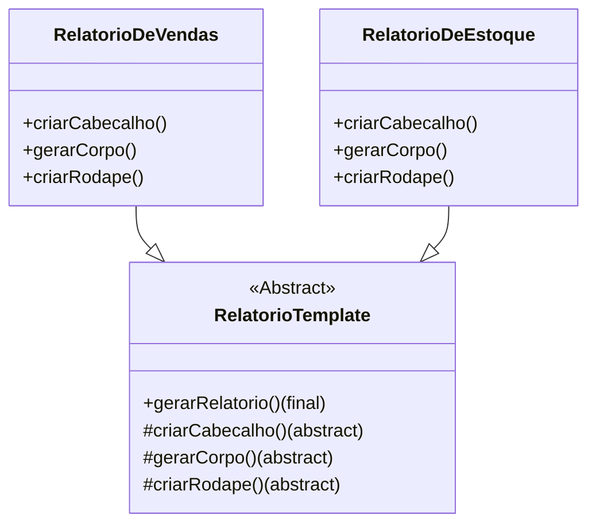

### **Aula – Padrão de Projeto: Template Method (Método Modelo)**

#### **🎯 Objetivo da Aula**

Compreender como o padrão **Template Method** define o esqueleto de um algoritmo em uma operação, adiando a definição de alguns passos para as subclasses, permitindo que elas redefinam certos passos de um algoritmo sem mudar sua estrutura.

-----

#### **🤔 O Problema: Duplicação de Código na Geração de Relatórios**

Imagine que nosso sistema precisa gerar vários tipos de relatórios (financeiros, de vendas, de estoque, etc.). Embora o conteúdo de cada relatório seja diferente, a **estrutura geral** do processo de geração é sempre a mesma:

1.  **Criar o Cabeçalho:** Inclui o logo da empresa e o título do relatório.
2.  **Gerar o Corpo:** A parte principal, que extrai e formata os dados específicos.
3.  **Criar o Rodapé:** Inclui a data de geração e o número da página.

**❌ A Solução sem um Padrão (Código Duplicado):**

Sem um padrão, poderíamos acabar com classes diferentes, cada uma com um método `gerar()` que duplica a mesma estrutura de passos:

```java
public class RelatorioDeVendas {
    public void gerar() {
        // Passo 1: Lógica do cabeçalho
        System.out.println("== LOGO DA EMPRESA ==");
        System.out.println("Título: Relatório de Vendas Mensal");
        System.out.println("---------------------------------");
        
        // Passo 2: Lógica do corpo (específica para vendas)
        System.out.println("Produto A - R$ 1000,00");
        System.out.println("Produto B - R$ 1500,00");
        
        // Passo 3: Lógica do rodapé
        System.out.println("---------------------------------");
        System.out.println("Data: 07/07/2025 - Página 1");
    }
}

public class RelatorioDeEstoque {
    public void gerar() {
        // Passo 1: Lógica do cabeçalho (CÓDIGO DUPLICADO)
        System.out.println("== LOGO DA EMPRESA ==");
        System.out.println("Título: Relatório de Estoque Atual");
        System.out.println("---------------------------------");

        // Passo 2: Lógica do corpo (específica para estoque)
        System.out.println("Produto A - 50 unidades");
        System.out.println("Produto B - 30 unidades");
        
        // Passo 3: Lógica do rodapé (CÓDIGO DUPLICADO)
        System.out.println("---------------------------------");
        System.out.println("Data: 07/07/2025 - Página 1");
    }
}
```

**❗ Problemas desta Abordagem:**

* **Código Duplicado:** A lógica para gerar o cabeçalho e o rodapé está copiada e colada em várias classes. Se precisarmos mudar o formato do rodapé, teremos que alterar todas as classes de relatório.
* **Falta de um "Contrato":** Não há nada que force a estrutura "cabeçalho-corpo-rodapé" a ser seguida. Um desenvolvedor poderia esquecer um dos passos em um novo relatório.

-----

### **💡 A Solução: Um "Modelo" de Algoritmo**

O padrão **Template Method** resolve isso criando uma **classe base abstrata** que define a estrutura do algoritmo (o "modelo"). As partes do algoritmo que são comuns a todos os relatórios são implementadas nesta classe base, enquanto as partes que variam são declaradas como métodos abstratos, que as subclasses concretas serão forçadas a implementar.

#### **🔧 Como Implementar o Template Method**

1.  **Criar a Classe Abstrata (`RelatorioTemplate`):** Ela conterá o **Template Method**.
2.  **Definir o Template Method:** Um método `public final`, para que as subclasses não possam sobrescrevê-lo. Este método define a sequência de passos do algoritmo, chamando os outros métodos na ordem correta.
3.  **Implementar os Passos Comuns:** Métodos que são iguais para todos (se houver) podem ser implementados diretamente na classe abstrata.
4.  **Declarar os Passos Variáveis:** Métodos que mudam para cada tipo de relatório (como `gerarCorpo`) são declarados como `protected abstract`.
5.  **Criar as Subclasses Concretas:** Cada tipo de relatório (`RelatorioDeVendas`) herda da classe abstrata e implementa apenas os métodos abstratos.

**Passo 1 a 4: A Classe Abstrata com o "Modelo"**

```java
// A Classe Abstrata que contém o Template Method
public abstract class RelatorioTemplate {
    
    // 1. Este é o Template Method. É final para que as subclasses não o alterem.
    public final void gerarRelatorio() {
        // Define o esqueleto do algoritmo
        criarCabecalho();
        gerarCorpo();
        criarRodape();
    }

    // 2. Métodos que são "ganchos" (hooks) para as subclasses preencherem.
    // São abstratos para forçar a implementação.
    protected abstract void criarCabecalho();
    protected abstract void gerarCorpo();
    protected abstract void criarRodape();
}
```

**Passo 5: As Subclasses Concretas**
As subclasses só precisam se preocupar com suas partes específicas.

```java
// Uma implementação concreta que preenche os "buracos" do modelo.
public class RelatorioDeVendas extends RelatorioTemplate {
    @Override
    protected void criarCabecalho() {
        System.out.println("== LOGO DA EMPRESA ==");
        System.out.println("Título: Relatório de Vendas Mensal");
    }

    @Override
    protected void gerarCorpo() {
        System.out.println("Corpo: Produto A - R$ 1000 | Produto B - R$ 1500");
    }

    @Override
    protected void criarRodape() {
        System.out.println("Rodapé: Data 07/07/2025 - confidenciavel.com");
    }
}
```

#### **📄 Usando o Template Method**

O cliente simplesmente instancia a classe concreta desejada e chama o método modelo.

```java
public class MainRelatorios {
    public static void main(String[] args) {
        System.out.println("--- Gerando Relatório de Vendas ---");
        RelatorioTemplate relatorioVendas = new RelatorioDeVendas();
        relatorioVendas.gerarRelatorio();

        // System.out.println("\n--- Gerando Relatório de Estoque ---");
        // RelatorioTemplate relatorioEstoque = new RelatorioDeEstoque();
        // relatorioEstoque.gerarRelatorio();
    }
}
```

-----

### **📊 Diagrama de Classes da Solução**



-----

### **Template Method vs. Strategy: Qual a Diferença?**

Esta é uma dúvida muito comum. A diferença está no uso de **herança vs. composição**.

* **Template Method:** Usa **herança**. A variação do algoritmo é feita por subclasses que sobrescrevem partes do esqueleto definido na classe pai. Você escolhe o comportamento no momento da compilação, ao instanciar uma subclasse específica.
* **Strategy:** Usa **composição**. A variação é feita fornecendo um objeto de "estratégia" diferente para um objeto de "contexto". O comportamento pode ser trocado em tempo de execução.

**Resumindo:** Use **Template Method** quando o esqueleto do algoritmo é fixo e você quer que as subclasses apenas "preencham as lacunas". Use **Strategy** quando você quer que o algoritmo *inteiro* seja substituível.

### **✅ Vantagens e Desvantagens**

* **Vantagens:**

    * **Evita Duplicação de Código:** Centraliza a parte invariável do algoritmo na classe base.
    * **Controle:** A classe base tem o controle sobre o algoritmo, e as subclasses não podem alterar sua estrutura, apenas o conteúdo de certos passos.
    * **Frameworks:** É a espinha dorsal de muitos frameworks. O framework define o esqueleto, e você, como desenvolvedor, implementa os detalhes.

* **Desvantagens:**

    * **Restritivo:** A estrutura do algoritmo é fixa e não pode ser alterada pelas subclasses.
    * **Acoplamento:** As subclasses estão fortemente acopladas à classe base devido à herança.

### **🤔 Quando Usar?**

* Quando você tem um algoritmo com uma estrutura bem definida, mas com detalhes de implementação que podem variar.
* Para evitar duplicação de código entre classes que implementam variações de um mesmo algoritmo.
* Ao criar um framework onde o código do framework chama métodos do seu código de cliente.